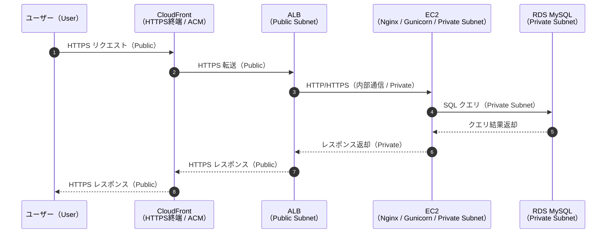
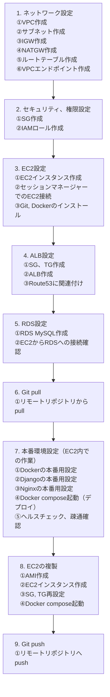

# ✨ かじまる
プロジェクト名の由来は、「家事 ＋ まるっと」であり、日々の家事を全部回す・まるく収めることをねらいとする。

## 📚 目次
- [プロジェクト概要](#プロジェクト概要)
- [自分の担当](#自分の担当)
- [背景](#背景)
- [ターゲット](#ターゲット)
- [使用技術](#使用技術)
- [技術選定理由](#技術選定理由)
- [スタート画面、ダッシュボード画面](#スタート画面ダッシュボード画面)
- [機能一覧](#機能一覧)
- [ディレクトリ・ファイル構成](#ディレクトリファイル構成)
- [開発環境確認手順](#開発環境確認手順)
- [インフラ設計の詳細](#インフラ設計の詳細)

## プロジェクト概要
- 開発体系：チーム開発（ハッカソン）
- 制作期間：2ヶ月
- メンバー：4名（フロントエンド1名、バックエンド2名、インフラ1名）

## 自分の担当
「インフラ」担当として、ディレクトリ・ファイルの構成検討、Dockerによる開発環境構築、ドメイン取得、AWSによる環境構築、デプロイを行った。  
自身のインフラ作業の詳細は、後述する「[インフラ設計の詳細](#インフラ設計の詳細)」にて示す。  
概要として、作成したインフラ構成図を以下に示す。  


## 背景
家庭やパートナーを持つと「家事の分担をどうするか」という問題が必ず生じると考えた。  
「家事の偏り」、「公平感の欠如」、「家事へのモチベーション維持」といった課題を解決するために、円滑に家事を回し、家族間のコミュニケーションを活発化するためのアプリを開発することとした。

## ターゲット
- 家事の偏りがあり不満を感じている人
- 子供に家事をさせたいが、継続できずに困っている親
- 家事を通じて家庭内のコミュニケーションを活発化させたい家庭

## 使用技術


| **カテゴリ** | **技術** |
| --- | --- |
| フロントエンド | HTML / CSS / JavaScript / Bootstrap 25.2 |
| バックエンド | Python 3.13 / Django 5.2.7 / MySQL 8.4 |
| インフラ | Docker / AWS / Gunicorn 23.0.0 / NGINX 1.28 |
| その他 | ovice / Mattermost / [draw.io](http://draw.io) / Canva / Figma / GitHub |

## 技術選定理由
<details>
    <summary>フロントエンド</summary>

**1) JavaScript** <br>
React, VueといったJavaScriptのライブラリ、フレームワークは、開発メンバーの知見がないことおよび2ヶ月間という限られた期間内では学習コストが高いため、素のJavaScript（Vanila JS）を採用することとした。

**2) Bootstrap** <br>
開発スピードの向上を図るため、HTMLのクラスの中でCSSを記述できるBootstrapを採用した。<br>
PythonのパッケージにDjangoの中で使用できる「django-bootstrap5」があるため、これを採用した。<br>

</details>

<details>
    <summary>バックエンド</summary>

**1) Python** <br>
開発メンバーの共通学習言語が「Python」であり、チーム開発を通じてさらにPythonの知識・経験を身につけるため「Python」を選定した。
PythonのバージョンはDjangoとの互換性を考慮して、2025年10月時点での最新バージョンである**3.13**とした。
DjangoとPythonのバージョン互換性は以下の公式ドキュメントに記載があり、その中の「DjangoでどのPythonのバージョンを使用すべきですか」についての回答より、「新しいバージョンのPythonはより高速で、多くの機能があり、サポートされているので、Python 3 の中でも最新バージョンを推奨します」との記載がある。
よって、開発スタート時の2025年10月時点での最新バージョンであるPython「3.13」を採用した。

参考URL
https://docs.djangoproject.com/ja/5.2/faq/install/

**2) Django** <br>
Pythonのフレームワークとして、フルスタックである**Django**を採用した。
チーム開発メンバーは「Flask」の経験があるものの、「Django」を使用して開発を行うことは初めてであったため、学習目的から「Django」を採用した。
Djangoのバージョンは、2025年10月時点でのLTS（Long Term Support：長期間安定サポート）である**5.2.7**を採用した。

**3) MySQL** <br>
MySQL、PostgreSQL、Sqliteの3つのデータベースを比較検討し、WEBアプリ開発の定番であり、リソース消費量、学習コストが小さい**MySQL**を採用することとした。
以下にデータベースの比較表を示す。<br>
また、MySQLのバージョンは、AWSのRDS MySQLがサポートしているバージョンとし、**8.4**とした。

| **選択肢** | **メリット** | **デメリット** | **活用事例** | **採用** |
| --- | --- | --- | --- | --- |
| MySQL | ・高速で読み取りが可能<br>・豊富なドキュメント情報がある<br>・運用がしやすい | ・複雑なクエリ処理ではPostgreSQLに劣る<br>・ライセンス料が発生する可能性がある | **1) 主な用途**<br>・Webアプリ<br>・中規模アプリ（1万～10万ユーザー）<br><br>**2) 接続数 / メモリ消費量**<br>・数千の同時接続<br>・100～500MB | ◯ |
| PostgreSQL | ・高機能かつ拡張性が高い<br>・豊富なデータ型<br>・複雑なクエリ処理に強い<br>・ACID準拠で堅牢性が高い | ・リソース消費量が大きめ<br>・設定が複雑で学習コストが高い | **1) 主な用途**<br>・ビジネスアプリ<br>・金融システム<br>・大規模アプリ（10万ユーザー以上）<br><br>**2) 接続数 / メモリ消費量**<br>・数万の同時接続<br>・200MB～1GB | △ |
| SQLite | ・インストール不要ですぐ使用可能<br>・単一ファイルで軽量<br>・プロトタイプに最適<br>・サーバー不要 | ・同時書き込みが苦手<br>・大容量データに不向き<br>・冗長化が難しい | **1) 主な用途**<br>・モバイルアプリ<br>・組み込みシステム<br>・小規模アプリ（〜1万ユーザー）<br><br>**2) 接続数 / メモリ消費量**<br>・単一プロセスのみ<br>・〜10MB | △ |

</details>

<details>
    <summary>インフラ</summary>

インフラ構造は、Web3層構造（Webサーバー、アプリケーションサーバー、データベースサーバー）とした。  
各層を独立させることで、「開発性・保守性」を向上させるものとした。  
また、自身がインフラ構築を初めて行うため、学習目的も兼ねて基本的なWeb3層構造を実装することとした。  

**1) Webサーバー** <br>
Webサーバーは、軽量コンテンツに向き、静的ファイルの配信が非常に高速な**Nginx**とする。<br>
以下にWebサーバーの比較表を示す。<br>

| **選択肢** | **メリット** | **デメリット** | **活用事例** | **採用** |
| --- | --- | --- | --- | --- |
| Apache | ・機能拡張が容易<br>・信頼性・安定性が高い<br>・情報が豊富<br>・重い処理に強い | ・メモリ消費が多い<br>・大量同時アクセスに弱い | ・動画中心のWebアプリ<br>・動的処理や柔軟な設定が必要な場合 | △ |
| Nginx | ・高速で高負荷に強い<br>・リバースプロキシ / ロードバランサ機能<br>・柔軟にカスタマイズ可能 | ・CPU負荷が高い処理には不向き<br>・単体で完結しづらい<br>・機能が少ない<br>・ソースコードが複雑 | ・軽量なコンテンツ<br>・静的ファイル / API の高速処理が必要な場合 | ◯ |

**2) アプリケーション・サーバー** <br>
アプリケーションサーバーは、Djangoとの親和性が高く、小中規模のアプリで活用されている**Gunicorn**とする。<br>
以下にアプリケーションサーバーの比較表を示す。<br>

| **選択肢** | **メリット** | **デメリット** | **活用事例** | **採用** |
| --- | --- | --- | --- | --- |
| Gunicorn（グニコーン） | ・設定がシンプルで起動が容易<br>・マルチコアを活用した並列処理<br>・高トラフィックに強い<br>・Flask / Django との相性が良い | ・非同期処理非対応<br>・プロセスごとにメモリ消費が大きい（Uvicornより多い） | ・Flask / Django の標準構成<br>・小～中規模アプリ<br>・HTTPプロトコル | ◯ |
| Uvicorn | ・非同期処理に対応（ASGI）<br>・軽量で低リソース | ・プロセス管理能力が弱い（Gunicornに劣る） | ・FastAPI の標準構成 | △ |
| uWSGI（ウエスギ） | ・多機能で拡張性が高い<br>・詳細メトリクス取得可能<br>・C実装で高速 | ・設定が複雑で学習コスト大<br>・非同期処理非対応 | ・大規模 / 高可用性が必要な企業向け<br>・uWSGIプロトコル使用 | △ |

**3) データベースサーバー** <br>
データベースサーバーは、前述の「バックエンド」の技術選定理由より、**MySQL**とする。

**4) AWS** <br>
AWSサービスの技術選定理由は「[インフラ設計の詳細](#インフラ設計の詳細)」で述べる。          
    
</details>

## スタート画面、ダッシュボード画面
### スタート画面
<table>
<tr>
<td></td>
<td></td>
<td></td>
</tr>
</table>
    
### ダッシュボード画面
<table>
<tr>
<td></td>
<td></td>
<td></td>
</tr>
</table>

## 機能一覧
<details>
<summary>MVP機能</summary>

| **カテゴリ** | **MVP機能** | **進捗** |
| --- | --- | --- |
| **登録画面** | 新規ユーザー登録(管理者のみ) | ◯ |
|  | 初期プロフィール作成 | ◯ |
|  | ログイン | ◯ |
|  | 参加コード（８桁）の発行 | ◯ |
|  | 招待コード入力画面 | ◯ |
| **ユーザー管理** | 共通端末ホーム | ◯ |
|  | 一般ユーザーのログイン | ◯ |
|  | 自身のマイページにログイン | ◯ |
|  | ログアウト | ◯ |
|  | セッションログアウト | ◯ |
|  | 一般ユーザー管理 | ◯ |
|  | タイムアウト | ◯ |
| **家事の自動ローテーション** | ローテ単位 | ◯ |
|  | タスクリストの作成 | ◯ |
|  | 各タスクの重み付け | ◯ |
|  | タスクリストから自動割当 | ◯ |
|  | 多忙フラグで自動回避 | ◯ |
| **ダッシュボード（ホーム画面）** | タスクの担当を表示 | ◯ |
|  | タスクの達成率を表示 | ◯ |
|  | 未着手家事表示 | ◯ |
|  | 割当重みづけ | ◯ |
| **通知** | 前夜/当日朝に担当者へ通知 | ◯ |
|  | 遅延の通知 | ◯ |
|  | チャンネル | ◯ |
|  | 担当表の通知 | ◯ |

</details>

<details>
<summary>追加機能</summary>

| **カテゴリ** | **追加機能** | **進捗** |
| --- | --- | --- |
| **買い物リスト** | アイテム/数量/メモ/カテゴリ管理 | ◯ |
|  | チェックボックスの設置 | ◯ |
|  | アイテムの追加 | ◯ |
|  | リストへ追加は承認を付ける | ◯ |
|  | 履歴の保管 | ◯ |
| **代役マッチング** | 代役リクエスト | ◯ |
|  | ワンタップ承認 | ◯ |
|  | 承認者に自動再配分 | ◯ |
|  | 履歴を保存 | ◯ |
| **家電・設備メンテ台帳** | 機器ごとに最終実施日/推奨実施日/月齢カウンタ | ◯ |
|  | 期限で自動でタスクに追加 | ◯ |
| **在庫ハブ** | 品目/単位/期間/最低在庫管理 | ◯ |
|  | ワンタップ減算 | ✕ |
|  | 低下時に「買い物リストに追加」 | ◯ |
| **天気×家事レコメンド** | 天気を取得 | ◯ |
|  | 天気と照合し今日のおすすめを提示 | ◯ |

</details>

## ディレクトリ・ファイル構成
<details>
<summary>ディレクトリ・ファイル構成</summary>
本プロジェクトのディレクトリ・ファイル構成を以下のとおり示す。

<pre>
.
└── kajimaru-app/
    ├── .github/
    │   └── workflows/
    │       ├── NotifyMEGE.yml
    │       └── NotifyPR.yml
    ├── docker/
    │   ├── django_cron
    │   ├── Dockerfile
    │   ├── Dockerfile.prod
    │   └── wait-for-it.sh
    ├── infra/
    │   └── nginx/
    │       ├── conf.d/
    │       │   └── kajimaru.conf
    │       ├── Dockerfile
    │       └── nginx.conf
    ├── src/
    │   ├── apps/
    │   │   ├── dashboard
    │   │   ├── maintenance
    │   │   ├── notification
    │   │   ├── rotation
    │   │   ├── shopping
    │   │   ├── stocks
    │   │   ├── user
    │   │   └── weather
    │   ├── config/
    │   │   ├── settings/
    │   │   │   ├── base.py
    │   │   │   ├── dev.py
    │   │   │   └── prod.py
    │   │   ├── asgi.py
    │   │   ├── urls.py
    │   │   ├── views.py
    │   │   └── wsgi.py
    │   ├── static/
    │   │   ├── css
    │   │   ├── img
    │   │   └── js
    │   ├── templates/
    │   │   ├── components
    │   │   ├── dashboard
    │   │   ├── maintenance
    │   │   ├── rotation
    │   │   ├── shopping
    │   │   ├── stocks
    │   │   ├── user
    │   │   └── base.html
    │   └── manage.py
    ├── staticfiles
    ├── .dockerignore
    ├── .env
    ├── .envexample
    ├── .gitignore
    ├── docker-compose.prod.yml
    ├── docerk-compose.yml
    ├── Makefile
    ├── README.md
    └── requirements.txt
</pre>
</details>

## 開発環境確認手順
<details>
<summary>Dockerの起動から終了までの手順</summary>

### 1) 環境変数ファイル.envの作成
.env.exampleをコピーして、.envファイルをプロジェクトルートディレクトリ直下に保存する。  
注）.envファイルは必ず、.env.exampleファイルと同じ階層に保存すること。（Docker、Djangoの設定ファイルで環境変数.envのファイルパスを指定しているため。）  
```
cp .env.example .env
```

以下が.env.exampleの中身であり、「各自で変更する設定」を各自で変更する。  
「DJANGO_SECRET_KEY」の設定は、以下のとおりである。  
```
python -c "import secrets; print(secrets.token_urlsafe(50))"
```

```
# ======= ✅ チームで共通にする設定 =======
MYSQL_DATABASE=django_db                    # 開発環境で使うデータベース名（チームで共通・固定）
MYSQL_USER=dev_user                         # 開発用のデータベースユーザ名（チーム共通）
MYSQL_HOST=db                               # Django(web)コンテナが接続するDBコンテナ名(db)（チーム共通）
DJANGO_PORT=8000                            # Djangoのポート番号（チーム共通）
DJANGO_LANGUAGE_CODE=ja                     # 言語コード設定(チーム共通)
DJANGO_ALLOWED_HOSTS=localhost,127.0.0.1    # アプリにアクセスできるホスト・ドメイン名（チーム共通）
DJANGO_SETTINGS_MODULE=config.settings.dev  # 開発環境ファイルの参照（チーム共通）
TZ=Asia/Tokyo                               # タイムゾーン設定（チーム共通）
USERNAME=appuser                            # コンテナ内のユーザーネーム（チーム共通）
GROUPNAME=appgroup                          # コンテナ内のグループネーム（チーム共通）

# ======= 🔧 各自で変更する設定 =======
MYSQL_PASSWORD=your_own_password            # 各自がローカル環境で設定するDBユーザーパスワード(環境開発で各自設定、非公開)
MYSQL_ROOT_PASSWORD=your_root_pw            # MYSQLのrootパスワード(開発環境で各自設定、非公開)
DJANGO_SECRET_KEY=your_secret_key           # Djangoのセキュリティキー(必ず各自で生成すること)
DJANGO_DEBUG=True                           # デバッグモード設定。開発中はTrue、本番や検証環境はFalse推奨
UID=your_uid                                # 各自のuidを指定（id -uコマンドで確認）
GID=your_gid                                # 各自のgidを指定（id -gコマンドで確認）
```

### 2) 起動時のdockerコマンド
初回起動ではイメージをビルドする必要があるため、以下のコマンドで起動させる。  
```
docker compose up --build
```  
もしくは  
```
make build
```  

※Makefileには、使用頻度の高いコマンドを省略して打てるように設定している。以降も通常版とmake版で記述する。

2回目以降は既にイメージがビルドされているため、以下のコマンドで起動してもよい。  
必要に応じて、 **-d** をupの後に付けて、バックグラウンドで起動してもよい。  
```
docker compose up -d
```  
もしくは  
```
make up
```

### 3) 終了時のdockerコマンド
終了時は以下のコマンドで終了する。  
必要に応じて、ボリューム（db_data）を削除する場合は、 **-v** をdownのあとに付ける。  
```
docker compose down
```  
もしくは  
```
make down
```
</details>

<details>
<summary>アクセス先</summary>
    
ブラウザで以下のアドレスを入力して、Djangoの初期画面が開いていることを確認する。  
```
http://localhost:8000/
```  
もしくは  
```
http://127.0.0.1:8000/
```  

ドキュメントが **「日本語」** 、DEBUGが **「True」** になっていることを確認する。  
成功すると以下の画面が表示される。  

</details>

<details>
<summary>各コンテナへのアクセス手順</summary>
    
### 1)MySQL(db)
MySQLコンテナへのアクセスは、以下のコマンドを入力する。  
```
docker compose exec -it db mysql -u dev_user -p
```  
もしくは  
```
make db
```  
コマンド入力後にパスワードを聞かれるため、.envの「MYSQL_PASSWORD」で設定したパスワードを各自入力する。  

### 2)Django(web)
Djangコンテナへのアクセスは、以下のコマンドを入力する。  
```
docker compose exec -it web /bin/bash
```  
もしくは  
```
make sh
```  

また、docker compose up -dで起動した後に、Djangoのlogsを確認したい場合は、以下のコマンドを入力する。  
```
docker compose logs -f web
```  
もしくは  
```
make logs
```  
</details>

<details>
<summary>Django 新規アプリ作成手順</summary>
    
### 1) 新規アプリの作成
以下のコマンドで新規アプリを作成する。  
通常のコマンドでは、長くなるため、以下のmakeコマンドを推奨する。  
<アプリ名>に作成したいアプリを入力する。  
```
make app name=<アプリ名>
```  
もしくは  
```
docker compose exec web mkdir -p apps/<アプリ名>
```  
```
docker compose exec web python manage.py startapp <アプリ名> apps/<アプリ名>
```  

コマンド入力後に、/src/appsの直下に指定したアプリが作成されていることを確認する。  

### 2) INSTALLED_APPSへの新規アプリ追加
以下のファイル（base.py）のINSTALLED_APPS変数へ新規アプリを追加する。  
```
/src/config/settings/base.py
```  
```
INSTALLED_APPS = [
    'django.contrib.admin',
    'django.contrib.auth',
    'django.contrib.contenttypes',
    'django.contrib.sessions',
    'django.contrib.messages',
    'django.contrib.staticfiles',
    '（ここにアプリを追加する。以下はアプリ名「test」の一例）',
    'apps.test.apps.TestConfig'
]
```

### 3) apps.pyへのname追加
新規作成したアプリディレクトリ内のapps.pyへnameを追加する。  
以下はアプリ名「test」とした場合の一例である。  
appsディレクトリ下にあるため、name=apps.<アプリ名>とする。  
```
class TestConfig(AppConfig):
    default_auto_field = 'django.db.models.BigAutoField'
    name = 'apps.test'
```
</details>

<details>
<summary>Django マイグレーションファイル作成、マイグレーションの手順</summary>
    
### 1) models.pyへのテーブル定義
該当アプリディレクトリのmodels.pyにテーブルを定義する。  

### 2) マイグレーションファイルの作成
models.pyのテーブル定義後、マイグレーションファイルを作成するために以下のコマンドを入力する。  
```
docker compose exec web python manage.py makemigrations
```  
もしくは  
```
make mm
```  
マイグレーションファイルが作成されると、該当ディレクトリの「migrations」にマイグレーションファイルが作成される。（例：0001_initial.py）  

### 3) マイグレーション（データベースへの反映）
マイグレーションファイルが作成された後に、以下のコマンドを入力して、データベースへ反映させる。  
```
docker compose exec web python manage.py migrate
```  
もしくは  
```
make migrate
```  

コマンド入力後に、MySQLコンテナへ入り、テーブルが作成されていれば、マイグレーション完了である。  
</details>

<details>
<summary>Django 管理者作成手順</summary>
    
Djangoでの管理者作成は、以下のコマンドで行う。  
```
docker compose exec web python manage.py createsuperuser
```  
もしくは  
```
make csu
```  
コマンド入力後に、ユーザー名、メールアドレス（省略可）、パスワードが聞かれるため、各自で設定する。  
ブラウザに以下のアドレスを入力し、設定したユーザー名とパスワードを入力し、ログインできるか確認する。  
```
http://localhost:8000/ or http://127.0.0.1:8000/
```  
成功すると以下の画面が表示される。  

</details>

<br>

## インフラ設計の詳細
以降より、自身が担当したインフラ設計の詳細を述べる。  

<details>
<summary>1. ディレクトリ・ファイル構成の検討</summary>
<br>

**1) Djangoの設定ファイルの切り分け**  
本アプリでは、**Django**を使用するため、はじめにDjangoのディレクトリ・ファイル構成の「ベストプラクティス」を検討した。  
Djangoの公式ドキュメントには、ディレクトリ・ファイル構成のベストプラクティスは示されていないものの、Qiita, Zenn等の技術記事に参考となりそうなディレクトリ・ファイル構成が掲載されていたため、これを準用することとした。  
具体的には、Djangoの設定ファイルである「settings.py」を「開発用」と「本番用」で分け、環境変数で切り替えることにより、運用性・保守性を向上させた。  
開発用と本番用でファイルを切り分けることにより、DEBUGのTrue/Falseの切り替え、Django, MySQLの機密情報の切り替え（.envとAWS ParameterStore/KMSの切り替え）、ALLOWED_HOSTS設定・セキュリティ設定等が開発用ソースコードを書き換えることなく可能となる。  
そのため、最新のdevelopブランチからgit pullでソースを取り込み、環境変数を切り替えるのみで本番環境への移行が可能となり、コンフリクトの回避、デプロイの効率化が図れる。  

以下にDjango設定ファイルの構成を抜粋して示す。  

<pre>
.
└── kajimaru-app/
    ├── src/
    │   ├── config/
    │   │   ├── settings/
    │   │   │   ├── base.py
    │   │   │   ├── dev.py
    │   │   │   └── prod.py
    │   │   ├── asgi.py
    │   │   ├── urls.py
    │   │   ├── views.py
    │   │   └── wsgi.py
    │   └── manage.py
</pre>

settings配下が設定ファイルの中身であり、base.pyには開発と本番で共通となる設定を記述した。  
dev.pyは開発環境用のファイル、prod.pyは本番環境用のファイルであり、それぞれbase.pyの内容をインポートして、開発と本番の差分をそれぞれのファイルに記述している。  
dev.py, prod.pyの切り替えは、manage.pyにて行い、以下のコードの「DJANGO_SETTINGS_MODULE」の環境変数にて切り替えを行っている。  
dev.pyを使用する場合は「config.settings.dev」、prod.pyを使用する場合は「config.settings.prod」となる。  
第二引数にはデフォルト値として、config.settings.devを設定し、環境変数に指定がない場合は、開発環境用ファイルを使用することとしている。

```
os.environ.setdefault('DJANGO_SETTINGS_MODULE', 'config.settings.dev')
```

**参考資料**  
https://plus-info-tech.com/django-pj-directory-structure#google_vignette  
https://qiita.com/ukisoft/items/8912d0a66151609d9ff9  

**2) Docker Compose, Dockerfileの切り分け**  
Docker compose, Dockerfileについても、開発環境と本番環境で切り分けを行い、開発環境のソースコードを残しつつ、本番環境設定を行った。  
以下にDocker関連ディレクトリ・ファイルを抜粋して示す。  

<pre>
.
└── kajimaru-app/
    ├── docker/
    │   ├── django_cron                # 本番環境用の自動通知設定
    │   ├── Dockerfile                 # 開発環境用
    │   ├── Dockerfile.prod            # 本番環境用
    │   └── wait-for-it.sh             # 開発環境用のコンテナ起動順の制御設定
    ├── infra/                         # 本番環境用（nginx）
    │   └── nginx/
    │       ├── conf.d/
    │       │   └── kajimaru.conf
    │       ├── Dockerfile
    │       └── nginx.conf
    ├── docker-compose.prod.yml        # 本番環境用
    ├── docerk-compose.yml             # 開発環境用
</pre>
</details>

<details>
<summary>2. インフラ技術の選定</summary>
<br>

前述の[使用技術](#使用技術)の「インフラ」より、インフラ構造は、Web3層構造（Webサーバー、アプリケーションサーバー、データベースサーバー）とし、各層を独立させることで、「開発性・保守性」を向上させるものとした。  
以下に選定したインフラ技術を示す。  

**1) クラウド**  
自身の学習目的および将来的な実務での活用を考慮し、全世界のクラウド市場シェア率がTopである**AWS**を選定した。  

**2) Webサーバー**  
前述の[使用技術](#使用技術)の「インフラ」より、軽量コンテンツに向き、静的ファイルの配信が非常に高速な**Nginx**とした。

**3) アプリケーションサーバー**  
前述の[使用技術](#使用技術)の「インフラ」より、Djangoとの親和性が高く、小中規模のアプリで活用されている**Gunicorn**とする。

**4) DBサーバー**  
前述の[使用技術](#使用技術)の「バックエンド」より、WEBアプリ開発の定番であり、リソース消費量、学習コストが小さい**MySQL**を採用することとした。  
また、MySQLのバージョンは、AWSのRDS MySQLがサポートしているバージョンとし、**8.4**とした。

</details>

<details>
<summary>3. Dockerによる開発環境構築</summary>
<br>

**1) コンテナ**  
開発環境で必要なコンテナは、DBサーバーである**MySQL**およびアプリケーションサーバーである**Django**(Python)である。  
Nginx, Gunicornは本番環境で必要となるため、開発環境では構築しないものとした。  
以下にMySQL、Djangoのコンテナ設定内容を示す。  

**1-1) MySQL**  
- MySQLのバージョンはAWS RDS MySQLとの整合性確保のため「8.4」とする。
- ポート番号は標準の「3306」とする。
- 文字コード、照合順序の設定を行うこととし、文字コードは「utf8mb4」、照合順序は「utf8mb4_0900_ai_ci」とする。
- ユーザー名、パスワード等の機密情報は.envから読み込む。
- 正常に動作しているか監視するためのhealthcheckを設定する。
- 名前付きボリュームにより、DBデータを永続化する。

**1-2) Django(Python)**  
- Pythonのバージョンは前述の[技術選定理由](#技術選定理由)より、Djangoとの互換性を考慮して、2025年10月時点での最新バージョンである**3.13**とする。
- 依存関係ファイル（requirements.txt）、コンテナ起動順制御スクリプト（wait-for-it.sh）をビルド時に読み込む必要があることに加え、コンテナ内の作業ディレクトリ（/src）とローカル環境ディレクトリ（src）をバインドマウントするため、Dockerfileに設定内容を記述してビルドを行う。
- MySQLコンテナが構築される前にDjangoがDBへの接続を試みてエラーが生じないようにするため、コンテナ起動順制御スクリプト（wait-for-it.sh）を使用する。これにより、MySQLコンテナが立ち上がった後（healthy後）にDjangoコンテナが立ち上がり、DBへ接続される。
- セキュリティ向上およびDjangoアプリ作成時のコンテナroot権限の付与を回避し、快適な開発環境構築を図るため、UID, GID, USERNAME, GROUPNAMEを指定する。
- 依存関係ファイルは先にコピーして、キャッシュ効率化を図る。
- ポート番号は標準の「8000」とする。

**2) 依存関係ファイル**  
依存関係ファイル（requirements.txt）には、Pythonのパッケージ管理コマンドである「pip」でインストールするフレームワーク、ライブラリ等を記述する。  
Django, Gunicorn, Bootstrap, mysqlclient等をインストールする。  

</details>

<details>
<summary>4. インフラ構成図の検討</summary>
<br>

**1) インフラ構成図**  
AWSを使用して、インフラを構築する。  
以下のとおり、インフラ構成図を示す。  


**2) インフラ構成図の考え方、技術選定理由**  
インフラ構成図の考え方、技術選定理由について、以下のとおり述べる。  

**2-1) 全体構成**  
- リージョンは「東京」として、サブネットは「パブリック」、「プライベート」をそれぞれ作成し、外部からの不正アクセス・盗聴リスクを下げるため、「パブリック」にはEC2、RDSを配置しない。
- 開発環境にDockerを使用しているため、「ECS」, 「Fargate」を使用した構成も考えられるが、自身がAWS構築が初めてであり、学習目的のため、基本的なサービスである**EC2**を採用することとした。EC2内にDockerをインストールして、手動でコンテナ管理を行う。
- EC2はマルチAZ構成にして、耐障害性の向上とALBによる通信の負荷分散を図る。また、EC2をマルチAZ構成にすることにより、一方のEC2を稼働させたまま、もう一方のEC2内のプロジェクトを修正できるメリトがあると考える。
- RDSはコスト削減のため、シングルAZ構成とする。本アプリは、短期間（1週間程度）の稼働のため、RDSを冗長化してデータ喪失リスクを抑えるよりも、コスト削減が優位になると考える。
- Route53を使用して、独自ドメインを設定する。ドメインは「お名前.com」より取得し、アプリ名である「kajimaru」が入るようにする。
- プライベート内に配置されたEC2, RDSがインターネットへ接続できるようにするため、NATGatewayを使用する。ただし、外部からEC2, RDSへ接続できないよう、インバウンドは許可せずに、アウトバウンドのみ許可する。
- NATGatewayは1時間単位で料金がかかり、2つのAZに配置するとコストが高くなるため、1つのAZに配置する。
- ALBはパブリックサブネットに配置し、ALBがHTTPSの終端となる。
- CloudFrontとS3を使用して、静的コンテンツの配信を高速化して、ユーザービリティの向上を図る。

**2-2) セキュリティ**  
- ALBにACMをアタッチして、HTTP通信にSSL/TLSを付与する。
- EC2への接続は、セッションマネージャーとVPCエンドポイントを使用して、踏み台サーバーによるssh接続よりもセキュアな接続とする。
- Parameter StoreとKey Management Serviceを使用して、.envにDB、Djangoのパスワード等を平文でEC2に保存するのを避け、セキュリティを向上させる。
- 類似サービスに「Secrets Manager」があり、違いは機密情報の「自動更新の有無」であるが、短期間（1週間程度）の稼働であり、コスト削減の観点から「Parameter Store」を採用する。 

**2-3) 運用・監視**  
- CloudWatchを使用して、CPU・メモリの使用量、リクエスト数等のメトリクスを監視・検知し、Flow Logsでネットワークの監視・検知を行う。
- 通知はemailに直接送るのではなく、SNS、Webhookを使用してMattermostで通知する。
- Mattermostにチームのチャネルがあり、Mattermostでのグループ内通知により問題の共有・対処の迅速化を図る。


</details>

<details>
<summary>5. 通信経路図</summary>
<br>

次のとおり、通信経路図を示す。

**1) 通信経路図**  



**2) 補足説明**  
- 静的ファイルはCloudFront + S3より直接レスポンスし、内部のEC2からはレスポンスしない。静的ファイルのリクエストは、CloudFrontがHTTPSの終端となる。
- Form送信等の動的なリクエストでは、ALBがHTTPSの終端となり、EC2・RDS MySQLの内部通信を経た後に、レスポンスが送られる。
- Nginxはリバースプロキシとして機能する。

</details>

<details>
<summary>6. AWS環境構築、デプロイ</summary>

<br>

**1) 作業フロー**  
以下にAWS環境構築、デプロイまでの作業フローを示す。  



**2) 各作業の詳細**  
前述の作業フローにおける各作業の詳細を次のとおり示す。  

**2-1) ネットワーク設定**  
**①VPC作成**  
VPC名は「kajimaru」として、IPv4 CIDR ブロックは「10.0.0.0/16」（最大の16ビットブロック）とした。  

**②サブネット作成**  
インフラ構成図より、サブネットは全部で「6」個とし、パブリック、プライベートで分ける。  
AZは「ap-northeast-1a」、「ap-northeast-1c」とした。  
サブネットのプレフィックスは、サブネット数、リソース数のバランスを取ることとし、「10.0.0.0/20」とした。  
これにより、サブネット4bit（サブネット数：16）、リソース12bit（リソース数：4091）として、リソース数を多めに取ることとした。  
各IPv4 サブネット CIDR ブロックは、以下のとおりである。  


**③IGW作成**  

**④NATGW作成**  

**⑤ルートテーブル作成**  

**⑥VPCエンドポイント作成**  

**2-2) セキュリティ、権限設定**  


**2-3) EC2設定**  
**①EC2インスタンス作成**  
EC2インスタンスを1台作成する。2台目のEC2インスタンスは、1台目のデプロイが完了した後に設定する。  
EC2のマシンイメージは、AWSに最適化されており、デフォルトでセキュリティが考慮されている「**Amazon Linux2023**」とする。  
インスタンスタイプは、コスト削減のため、無料枠の「**t2.micro**」とする。  

**②セッションマネージャーでのEC2接続**  


**③Git, Dockerのインストール**  
セッションマネージャーでEC2に接続し、EC2内にGit, Dockerをインストールする。  
Gitのインストールの詳細は、以下の記事を参照することとする。  
https://qiita.com/myaX/items/677cfd8a669d6c7eff80  
<br>
GitインストールおよびGitHubへのssh接続が完了した後に、対象のリポジトリをリモート設定する。  
```
git remote -v
```
```
git remote set-url origin <新しいURL>
```

<br>

次にDockerをインストールする。  
Amazon Linux2023のリポジトリには、「docker（エンジン）」はあるものの、「docker compose」はなく、「docker（エンジン）」のみのインストールでは、docker composeコマンドがエラーとなる。  
そのため、docker composeのGitHubリポジトリからインストールする。  
さらに、docker composeをインストールし、docker compose up --buildコマンドを叩くと、docker buildxのバージョンが古くエラーとなる。  
よって、docker buildxのバージョンアップも行う必要があるため、githubリポジトリからdocker buildxをインストールする。  
各手順を整理すると以下のとおりとなる。  

- docker（エンジン）のインストール
  
```
sudo dnf -y install docker
```
```
docker version
```

- dockerの自動起動設定

```
systemctl enable --now docker
```

- docker composeのインストール

docker composeのGitHubリポジトリより、現時点（2025/11月時点）での最新バージョンは「v2.40.3」である。  
Amazon Linux 2023の「docker」より、バージョンは「25.0.8-1」であり、docker engineとdocker composeの互換表を確認すると、docker Engine「19.03.0+」に対して、docker compose仕様は「3.8」であり、これらの関係から、互換性はあると考えられる。  
よって、最新版の「v2.40.3」をインストールする。  
「v2.40.3」のAssetsを確認すると、OS、アーキテクチャに応じてインストールするものが決まるため、EC2のOS、アーキテクチャを確認する。  
uname, uname -mとコマンドを叩くと「Linux」、「X86_64」が表示される。  
よってAssetsより、「Linux」, 「X86_64」に合致するものをインストールする。
インストール手順は以下のとおりである。

```
mkdir -p /usr/local/lib/docker/cli-plugins/
```

OS、アーキテクチャが「Linux」、「X86_64」であることを確認する。
```
uname
```
```
uname -m
```

OS、アーキテクチャを確認後に、インストールを行う。
```
curl -SL https://github.com/docker/compose/releases/download/v2.40.3/docker-compose-linux-x86_64 -o /usr/local/lib/docker/cli-plugins/docker-compose
```
```
chmod +x /usr/local/lib/docker/cli-plugins/docker-compose
```
```
docker compose version
```

- docker buildxのインストール

docker buildxのGitHubリポジトリより、Linuxでの保存先は「$HOME/.docker/cli-plugins」が推奨されている。  
よって、mkdir -p ~/.docker/cli-pluginsとして保存ディレクトリを作成する。  
また、「DockerでBuildxを使用するには、Dockerエンジン19.03以降が必要です。」と記載がある。  
Amazon Linux 2023リポジトリより、dockerのバージョンは「25.0.8-1」と記載があるため、19.03以上であるため、バージョンの問題はないと考えられる。  
念のため、「docker version」でバージョンを確認する。  
buldxの最新バージョンはv0.30.0（2025/11月時点）であり、こちらをインストールする。  
OS、アーキテクチャは「Linux」、「X86_64」であるため、これと同じ種類を選択する。  
見たところx86_64は見当たらないが、別名の「amd64」（=x86_64）はあるため、これをインストールする。  
インストール手順は以下のとおりである。

```
mkdir -p ~/.docker/cli-plugins
```
```
curl -SL https://github.com/docker/buildx/releases/download/v0.30.0/buildx-v0.30.0.linux-amd64 \
-o ~/.docker/cli-plugins/docker-buildx
```
```
chmod +x ~/.docker/cli-plugins/docker-buildx
```
```
docker buildx version
```

**参考資料**  
- Amazon Linux 2023のリポジトリ一覧  
https://docs.aws.amazon.com/ja_jp/linux/al2023/release-notes/all-packages-AL2023.9.html
- docker engine / docker composeのインストール  
https://sig9.org/blog/2023/08/28/
- docker composeのGitHubリポジトリ  
https://github.com/docker/compose/releases
- docker engineとdocker composeの互換表  
https://docs.docker.jp/compose/compose-file/compose-versioning.html#compose-file-compatibility-matrix

**2-4) ALB設定**  


**2-5) RDS設定**  
**①RDS MySQL作成**  
RDS MySQLのメジャーバージョンは、標準サポートがある**8.4**とした。  
**8.0**は標準サポート期限が「2026年7月31日」であり、実務での長期運用を想定した場合に避けたほうがいいと考えた。  
マイナーバージョンは、開発環境との整合を取るため、開発開始時の2025年10月時点での最新版とし、**8.4.6**とした。  
RDS MySQLはコスト削減のため「無料利用枠」を指定し、インスタンスタイプは**db.t4g.micro**とし、ストレージは**汎用SSD**（gp2）の**20GB**とした。  

**②EC2からRDSへの接続確認**  
RDS MySQLが作成できた後に、セッションマネージャーでEC2内にアクセスし、EC2からRDS MySQLの接続確認を行う。  
EC2のマシンイメージは「Amazon Linux2023」であるが、Amazon Linux2023のリポジトリには、MySQL本家のクライアント（mysql）がない（2025年11月時点）。  
そのため、AWS公式ドキュメントより推奨の「MariaDBクライアント」をインストールして、RDS MySQLに接続する。  
以下に接続確認のコマンドを示す。  

- インストール
```
sudo dnf install mariadb105
```

- バージョン確認  
```
mysql -V
```

- 接続
```
mysql -h エンドポイント -u admin（もしくは設定したユーザー名） -p
```

**参考資料**  
https://docs.aws.amazon.com/ja_jp/AmazonRDS/latest/UserGuide/mysql-install-cli.html  

<br>

**2-6) Git pull**  
GitHubのリモートリポジトリからEC2へ、最新のdevelopブランチをpull（初回はclone）する。  
ブランチ戦略は「git flow」に準じ、developブランチからreleaseブランチを切って、本番環境を設定する。  

**2-7) 本番環境設定（EC2内での作業）**  


**2-8) EC2の複製**  


**2-9) Git push**  
本番環境設定が完了し、デプロイが確認できた後に、GitHubのリモートリポジトリへpushする。  
git flowに準じ、releaseブランチからmainブランチへpushする。  
これにより、本番環境設定をチームメンバーに共有する。  

</details>


