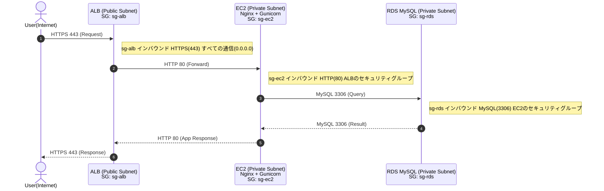
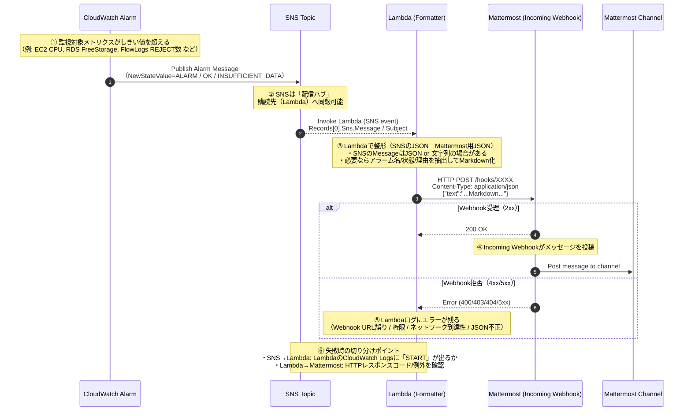

# ✨ かじまる
プロジェクト名の由来は、「家事 ＋ まるっと」であり、日々の家事を全部回す・まるく収めることをねらいとする。

## 🔗 URL
<https://kajimaru.com>  
スマートフォン専用アプリです。  
PCから使用する場合は、開発者ツール（developer tools）を開いてご使用ください。  
Windowsでは「F12」、Macでは「Command + Option + I」がショートカットキーです。  
「2026年2月末」まで公開予定です。（変更する場合がございます。）

## 📚 目次
- [プロジェクト概要](#プロジェクト概要)
- [自分の担当](#自分の担当)
- [背景](#背景)
- [ターゲット](#ターゲット)
- [使用技術](#使用技術)
- [技術選定理由](#技術選定理由)
- [スタート画面、ダッシュボード画面](#スタート画面ダッシュボード画面)
- [機能一覧](#機能一覧)
- [ディレクトリ・ファイル構成](#ディレクトリファイル構成)
- [開発環境確認手順](#開発環境確認手順)
- [インフラ設計の詳細](#インフラ設計の詳細)

## プロジェクト概要
- 開発体系：チーム開発（ハッカソン）
- 制作期間：2ヶ月
- メンバー：4名（フロントエンド1名、バックエンド2名、インフラ1名）

## 自分の担当
「インフラ」担当として、ディレクトリ・ファイルの構成検討、Dockerによる開発環境構築、ドメイン取得、AWSによる環境構築、デプロイを行った。  
自身のインフラ作業の詳細は、後述する「[インフラ設計の詳細](#インフラ設計の詳細)」にて示す。  
概要として、作成したインフラ構成図を以下に示す。  


## 背景
家庭やパートナーを持つと「家事の分担をどうするか」という問題が必ず生じると考えた。  
「家事の偏り」、「公平感の欠如」、「家事へのモチベーション維持」といった課題を解決するために、円滑に家事を回し、家族間のコミュニケーションを活発化するためのアプリを開発することとした。

## ターゲット
- 家事の偏りがあり不満を感じている人
- 子供に家事をさせたいが、継続できずに困っている親
- 家事を通じて家庭内のコミュニケーションを活発化させたい家庭

## 使用技術


<br/>

| **カテゴリ** | **技術** |
| --- | --- |
| フロントエンド | HTML / CSS / JavaScript / Bootstrap 25.2 |
| バックエンド | Python 3.13 / Django 5.2.7 / MySQL 8.4 |
| インフラ | Docker / AWS / Gunicorn 23.0.0 / NGINX 1.28 |
| その他 | ovice / Mattermost / [draw.io](http://draw.io) / Canva / Figma / GitHub |

## 技術選定理由
<details>
    <summary>フロントエンド</summary>

**1) JavaScript** <br>
React, VueといったJavaScriptのライブラリ、フレームワークは、開発メンバーの知見がないことおよび2ヶ月間という限られた期間内では学習コストが高いため、素のJavaScript（Vanila JS）を採用することとした。

**2) Bootstrap** <br>
開発スピードの向上を図るため、HTMLのクラスの中でCSSを記述できるBootstrapを採用した。<br>
PythonのパッケージにDjangoの中で使用できる「django-bootstrap5」があるため、これを採用した。<br>

</details>

<details>
    <summary>バックエンド</summary>

**1) Python** <br>
開発メンバーの共通学習言語が「Python」であり、チーム開発を通じてさらにPythonの知識・経験を身につけるため「Python」を選定した。
PythonのバージョンはDjangoとの互換性を考慮して、2025年10月時点での最新バージョンである**3.13**とした。
DjangoとPythonのバージョン互換性は以下の公式ドキュメントに記載があり、その中の「DjangoでどのPythonのバージョンを使用すべきですか」についての回答より、「新しいバージョンのPythonはより高速で、多くの機能があり、サポートされているので、Python 3 の中でも最新バージョンを推奨します」との記載がある。
よって、開発スタート時の2025年10月時点での最新バージョンであるPython「3.13」を採用した。

参考URL
https://docs.djangoproject.com/ja/5.2/faq/install/

**2) Django** <br>
Pythonのフレームワークとして、フルスタックである**Django**を採用した。
チーム開発メンバーは「Flask」の経験があるものの、「Django」を使用して開発を行うことは初めてであったため、学習目的から「Django」を採用した。
Djangoのバージョンは、2025年10月時点でのLTS（Long Term Support：長期間安定サポート）である**5.2.7**を採用した。

**3) MySQL** <br>
MySQL、PostgreSQL、Sqliteの3つのデータベースを比較検討し、WEBアプリ開発の定番であり、リソース消費量、学習コストが小さい**MySQL**を採用することとした。
以下にデータベースの比較表を示す。<br>
また、MySQLのバージョンは、AWSのRDS MySQLがサポートしているバージョンとし、**8.4**とした。

| **選択肢** | **メリット** | **デメリット** | **活用事例** | **採用** |
| --- | --- | --- | --- | --- |
| MySQL | ・高速で読み取りが可能<br>・豊富なドキュメント情報がある<br>・運用がしやすい | ・複雑なクエリ処理ではPostgreSQLに劣る<br>・ライセンス料が発生する可能性がある | **1) 主な用途**<br>・Webアプリ<br>・中規模アプリ（1万～10万ユーザー）<br><br>**2) 接続数 / メモリ消費量**<br>・数千の同時接続<br>・100～500MB | ◯ |
| PostgreSQL | ・高機能かつ拡張性が高い<br>・豊富なデータ型<br>・複雑なクエリ処理に強い<br>・ACID準拠で堅牢性が高い | ・リソース消費量が大きめ<br>・設定が複雑で学習コストが高い | **1) 主な用途**<br>・ビジネスアプリ<br>・金融システム<br>・大規模アプリ（10万ユーザー以上）<br><br>**2) 接続数 / メモリ消費量**<br>・数万の同時接続<br>・200MB～1GB | △ |
| SQLite | ・インストール不要ですぐ使用可能<br>・単一ファイルで軽量<br>・プロトタイプに最適<br>・サーバー不要 | ・同時書き込みが苦手<br>・大容量データに不向き<br>・冗長化が難しい | **1) 主な用途**<br>・モバイルアプリ<br>・組み込みシステム<br>・小規模アプリ（〜1万ユーザー）<br><br>**2) 接続数 / メモリ消費量**<br>・単一プロセスのみ<br>・〜10MB | △ |

</details>

<details>
    <summary>インフラ</summary>

インフラ構造は、Web3層構造（Webサーバー、アプリケーションサーバー、データベースサーバー）とした。  
各層を独立させることで、「開発性・保守性」を向上させるものとした。  
また、自身がインフラ構築を初めて行うため、学習目的も兼ねて基本的なWeb3層構造を実装することとした。  

**1) Webサーバー** <br>
Webサーバーは、軽量コンテンツに向き、静的ファイルの配信が非常に高速な**Nginx**とする。<br>
以下にWebサーバーの比較表を示す。<br>

| **選択肢** | **メリット** | **デメリット** | **活用事例** | **採用** |
| --- | --- | --- | --- | --- |
| Apache | ・機能拡張が容易<br>・信頼性・安定性が高い<br>・情報が豊富<br>・重い処理に強い | ・メモリ消費が多い<br>・大量同時アクセスに弱い | ・動画中心のWebアプリ<br>・動的処理や柔軟な設定が必要な場合 | △ |
| Nginx | ・高速で高負荷に強い<br>・リバースプロキシ / ロードバランサ機能<br>・柔軟にカスタマイズ可能 | ・CPU負荷が高い処理には不向き<br>・単体で完結しづらい<br>・機能が少ない<br>・ソースコードが複雑 | ・軽量なコンテンツ<br>・静的ファイル / API の高速処理が必要な場合 | ◯ |

**2) アプリケーション・サーバー** <br>
アプリケーションサーバーは、Djangoとの親和性が高く、小中規模のアプリで活用されている**Gunicorn**とする。<br>
以下にアプリケーションサーバーの比較表を示す。<br>

| **選択肢** | **メリット** | **デメリット** | **活用事例** | **採用** |
| --- | --- | --- | --- | --- |
| Gunicorn（グニコーン） | ・設定がシンプルで起動が容易<br>・マルチコアを活用した並列処理<br>・高トラフィックに強い<br>・Flask / Django との相性が良い | ・非同期処理非対応<br>・プロセスごとにメモリ消費が大きい（Uvicornより多い） | ・Flask / Django の標準構成<br>・小～中規模アプリ<br>・HTTPプロトコル | ◯ |
| Uvicorn | ・非同期処理に対応（ASGI）<br>・軽量で低リソース | ・プロセス管理能力が弱い（Gunicornに劣る） | ・FastAPI の標準構成 | △ |
| uWSGI（ウエスギ） | ・多機能で拡張性が高い<br>・詳細メトリクス取得可能<br>・C実装で高速 | ・設定が複雑で学習コスト大<br>・非同期処理非対応 | ・大規模 / 高可用性が必要な企業向け<br>・uWSGIプロトコル使用 | △ |

**3) データベースサーバー** <br>
データベースサーバーは、前述の「バックエンド」の技術選定理由より、**MySQL**とする。

**4) AWS** <br>
AWSサービスの技術選定理由は「[インフラ設計の詳細](#インフラ設計の詳細)」で述べる。          
    
</details>

## スタート画面、ダッシュボード画面
### スタート画面
<table>
<tr>
<td></td>
<td></td>
<td></td>
</tr>
</table>
    
### ダッシュボード画面
<table>
<tr>
<td></td>
<td></td>
<td></td>
</tr>
</table>

## 機能一覧
<details>
<summary>MVP機能</summary>

| **カテゴリ** | **MVP機能** | **進捗** |
| --- | --- | --- |
| **登録画面** | 新規ユーザー登録(管理者のみ) | ◯ |
|  | 初期プロフィール作成 | ◯ |
|  | ログイン | ◯ |
|  | 参加コード（８桁）の発行 | ◯ |
|  | 招待コード入力画面 | ◯ |
| **ユーザー管理** | 共通端末ホーム | ◯ |
|  | 一般ユーザーのログイン | ◯ |
|  | 自身のマイページにログイン | ◯ |
|  | ログアウト | ◯ |
|  | セッションログアウト | ◯ |
|  | 一般ユーザー管理 | ◯ |
|  | タイムアウト | ◯ |
| **家事の自動ローテーション** | ローテ単位 | ◯ |
|  | タスクリストの作成 | ◯ |
|  | 各タスクの重み付け | ◯ |
|  | タスクリストから自動割当 | ◯ |
|  | 多忙フラグで自動回避 | ◯ |
| **ダッシュボード（ホーム画面）** | タスクの担当を表示 | ◯ |
|  | タスクの達成率を表示 | ◯ |
|  | 未着手家事表示 | ◯ |
|  | 割当重みづけ | ◯ |
| **通知** | 前夜/当日朝に担当者へ通知 | ◯ |
|  | 遅延の通知 | ◯ |
|  | チャンネル | ◯ |
|  | 担当表の通知 | ◯ |

</details>

<details>
<summary>追加機能</summary>

| **カテゴリ** | **追加機能** | **進捗** |
| --- | --- | --- |
| **買い物リスト** | アイテム/数量/メモ/カテゴリ管理 | ◯ |
|  | チェックボックスの設置 | ◯ |
|  | アイテムの追加 | ◯ |
|  | リストへ追加は承認を付ける | ◯ |
|  | 履歴の保管 | ◯ |
| **代役マッチング** | 代役リクエスト | ◯ |
|  | ワンタップ承認 | ◯ |
|  | 承認者に自動再配分 | ◯ |
|  | 履歴を保存 | ◯ |
| **家電・設備メンテ台帳** | 機器ごとに最終実施日/推奨実施日/月齢カウンタ | ◯ |
|  | 期限で自動でタスクに追加 | ◯ |
| **在庫ハブ** | 品目/単位/期間/最低在庫管理 | ◯ |
|  | ワンタップ減算 | ✕ |
|  | 低下時に「買い物リストに追加」 | ◯ |
| **天気×家事レコメンド** | 天気を取得 | ◯ |
|  | 天気と照合し今日のおすすめを提示 | ◯ |

</details>

## ディレクトリ・ファイル構成
<details>
<summary>ディレクトリ・ファイル構成</summary>
本プロジェクトのディレクトリ・ファイル構成を以下のとおり示す。

<pre>
.
└── kajimaru-app/
    ├── .github/
    │   └── workflows/
    │       ├── NotifyMEGE.yml
    │       └── NotifyPR.yml
    ├── docker/
    │   ├── django_cron
    │   ├── Dockerfile
    │   ├── Dockerfile.prod
    │   └── wait-for-it.sh
    ├── infra/
    │   └── nginx/
    │       ├── conf.d/
    │       │   └── kajimaru.conf
    │       ├── Dockerfile
    │       └── nginx.conf
    ├── src/
    │   ├── apps/
    │   │   ├── dashboard
    │   │   ├── maintenance
    │   │   ├── notification
    │   │   ├── rotation
    │   │   ├── shopping
    │   │   ├── stocks
    │   │   ├── user
    │   │   └── weather
    │   ├── config/
    │   │   ├── settings/
    │   │   │   ├── base.py
    │   │   │   ├── dev.py
    │   │   │   └── prod.py
    │   │   ├── asgi.py
    │   │   ├── urls.py
    │   │   ├── views.py
    │   │   └── wsgi.py
    │   ├── static/
    │   │   ├── css
    │   │   ├── img
    │   │   └── js
    │   ├── templates/
    │   │   ├── components
    │   │   ├── dashboard
    │   │   ├── maintenance
    │   │   ├── rotation
    │   │   ├── shopping
    │   │   ├── stocks
    │   │   ├── user
    │   │   └── base.html
    │   └── manage.py
    ├── staticfiles
    ├── .dockerignore
    ├── .env
    ├── .envexample
    ├── .gitignore
    ├── docker-compose.prod.yml
    ├── docerk-compose.yml
    ├── Makefile
    ├── README.md
    └── requirements.txt
</pre>
</details>

## 開発環境確認手順
<details>
<summary>Dockerの起動から終了までの手順</summary>

### 1) 環境変数ファイル.envの作成
.env.exampleをコピーして、.envファイルをプロジェクトルートディレクトリ直下に保存する。  
注）.envファイルは必ず、.env.exampleファイルと同じ階層に保存すること。（Docker、Djangoの設定ファイルで環境変数.envのファイルパスを指定しているため。）  
```
cp .env.example .env
```

以下が.env.exampleの中身であり、「各自で変更する設定」を各自で変更する。  
「DJANGO_SECRET_KEY」の設定は、以下のとおりである。  
```
python -c "import secrets; print(secrets.token_urlsafe(50))"
```

```
# ======= ✅ チームで共通にする設定 =======
MYSQL_DATABASE=django_db                    # 開発環境で使うデータベース名（チームで共通・固定）
MYSQL_USER=dev_user                         # 開発用のデータベースユーザ名（チーム共通）
MYSQL_HOST=db                               # Django(web)コンテナが接続するDBコンテナ名(db)（チーム共通）
DJANGO_PORT=8000                            # Djangoのポート番号（チーム共通）
DJANGO_LANGUAGE_CODE=ja                     # 言語コード設定(チーム共通)
DJANGO_ALLOWED_HOSTS=localhost,127.0.0.1    # アプリにアクセスできるホスト・ドメイン名（チーム共通）
DJANGO_SETTINGS_MODULE=config.settings.dev  # 開発環境ファイルの参照（チーム共通）
TZ=Asia/Tokyo                               # タイムゾーン設定（チーム共通）
USERNAME=appuser                            # コンテナ内のユーザーネーム（チーム共通）
GROUPNAME=appgroup                          # コンテナ内のグループネーム（チーム共通）

# ======= 🔧 各自で変更する設定 =======
MYSQL_PASSWORD=your_own_password            # 各自がローカル環境で設定するDBユーザーパスワード(環境開発で各自設定、非公開)
MYSQL_ROOT_PASSWORD=your_root_pw            # MYSQLのrootパスワード(開発環境で各自設定、非公開)
DJANGO_SECRET_KEY=your_secret_key           # Djangoのセキュリティキー(必ず各自で生成すること)
DJANGO_DEBUG=True                           # デバッグモード設定。開発中はTrue、本番や検証環境はFalse推奨
UID=your_uid                                # 各自のuidを指定（id -uコマンドで確認）
GID=your_gid                                # 各自のgidを指定（id -gコマンドで確認）
```

### 2) 起動時のdockerコマンド
初回起動ではイメージをビルドする必要があるため、以下のコマンドで起動させる。  
```
docker compose up --build
```  
もしくは  
```
make build
```  

※Makefileには、使用頻度の高いコマンドを省略して打てるように設定している。以降も通常版とmake版で記述する。

2回目以降は既にイメージがビルドされているため、以下のコマンドで起動してもよい。  
必要に応じて、 **-d** をupの後に付けて、バックグラウンドで起動してもよい。  
```
docker compose up -d
```  
もしくは  
```
make up
```

### 3) 終了時のdockerコマンド
終了時は以下のコマンドで終了する。  
必要に応じて、ボリューム（db_data）を削除する場合は、 **-v** をdownのあとに付ける。  
```
docker compose down
```  
もしくは  
```
make down
```
</details>

<details>
<summary>アクセス先</summary>
    
ブラウザで以下のアドレスを入力して、Djangoの初期画面が開いていることを確認する。  
```
http://localhost:8000/
```  
もしくは  
```
http://127.0.0.1:8000/
```  

ドキュメントが **「日本語」** 、DEBUGが **「True」** になっていることを確認する。  
成功すると以下の画面が表示される。  

</details>

<details>
<summary>各コンテナへのアクセス手順</summary>
    
### 1)MySQL(db)
MySQLコンテナへのアクセスは、以下のコマンドを入力する。  
```
docker compose exec -it db mysql -u dev_user -p
```  
もしくは  
```
make db
```  
コマンド入力後にパスワードを聞かれるため、.envの「MYSQL_PASSWORD」で設定したパスワードを各自入力する。  

### 2)Django(web)
Djangコンテナへのアクセスは、以下のコマンドを入力する。  
```
docker compose exec -it web /bin/bash
```  
もしくは  
```
make sh
```  

また、docker compose up -dで起動した後に、Djangoのlogsを確認したい場合は、以下のコマンドを入力する。  
```
docker compose logs -f web
```  
もしくは  
```
make logs
```  
</details>

<details>
<summary>Django 新規アプリ作成手順</summary>
    
### 1) 新規アプリの作成
以下のコマンドで新規アプリを作成する。  
通常のコマンドでは、長くなるため、以下のmakeコマンドを推奨する。  
<アプリ名>に作成したいアプリを入力する。  
```
make app name=<アプリ名>
```  
もしくは  
```
docker compose exec web mkdir -p apps/<アプリ名>
```  
```
docker compose exec web python manage.py startapp <アプリ名> apps/<アプリ名>
```  

コマンド入力後に、/src/appsの直下に指定したアプリが作成されていることを確認する。  

### 2) INSTALLED_APPSへの新規アプリ追加
以下のファイル（base.py）のINSTALLED_APPS変数へ新規アプリを追加する。  
```
/src/config/settings/base.py
```  
```
INSTALLED_APPS = [
    'django.contrib.admin',
    'django.contrib.auth',
    'django.contrib.contenttypes',
    'django.contrib.sessions',
    'django.contrib.messages',
    'django.contrib.staticfiles',
    '（ここにアプリを追加する。以下はアプリ名「test」の一例）',
    'apps.test.apps.TestConfig'
]
```

### 3) apps.pyへのname追加
新規作成したアプリディレクトリ内のapps.pyへnameを追加する。  
以下はアプリ名「test」とした場合の一例である。  
appsディレクトリ下にあるため、name=apps.<アプリ名>とする。  
```
class TestConfig(AppConfig):
    default_auto_field = 'django.db.models.BigAutoField'
    name = 'apps.test'
```
</details>

<details>
<summary>Django マイグレーションファイル作成、マイグレーションの手順</summary>
    
### 1) models.pyへのテーブル定義
該当アプリディレクトリのmodels.pyにテーブルを定義する。  

### 2) マイグレーションファイルの作成
models.pyのテーブル定義後、マイグレーションファイルを作成するために以下のコマンドを入力する。  
```
docker compose exec web python manage.py makemigrations
```  
もしくは  
```
make mm
```  
マイグレーションファイルが作成されると、該当ディレクトリの「migrations」にマイグレーションファイルが作成される。（例：0001_initial.py）  

### 3) マイグレーション（データベースへの反映）
マイグレーションファイルが作成された後に、以下のコマンドを入力して、データベースへ反映させる。  
```
docker compose exec web python manage.py migrate
```  
もしくは  
```
make migrate
```  

コマンド入力後に、MySQLコンテナへ入り、テーブルが作成されていれば、マイグレーション完了である。  
</details>

<details>
<summary>Django 管理者作成手順</summary>
    
Djangoでの管理者作成は、以下のコマンドで行う。  
```
docker compose exec web python manage.py createsuperuser
```  
もしくは  
```
make csu
```  
コマンド入力後に、ユーザー名、メールアドレス（省略可）、パスワードが聞かれるため、各自で設定する。  
ブラウザに以下のアドレスを入力し、設定したユーザー名とパスワードを入力し、ログインできるか確認する。  
```
http://localhost:8000/ or http://127.0.0.1:8000/
```  
成功すると以下の画面が表示される。  

</details>


## インフラ設計の詳細
以降より、自身が担当したインフラ設計の詳細を述べる。  

<details>
<summary>1. ディレクトリ・ファイル構成の検討</summary>
<br>

**1) Djangoの設定ファイルの切り分け**  
本アプリでは、**Django**を使用するため、はじめにDjangoのディレクトリ・ファイル構成の「ベストプラクティス」を検討した。  
Djangoの公式ドキュメントには、ディレクトリ・ファイル構成のベストプラクティスは示されていないものの、Qiita, Zenn等の技術記事に参考となりそうなディレクトリ・ファイル構成が掲載されていたため、これを準用することとした。  
具体的には、Djangoの設定ファイルである「settings.py」を「開発用」と「本番用」で分け、環境変数で切り替えることにより、運用性・保守性を向上させた。  
開発用と本番用でファイルを切り分けることにより、DEBUGのTrue/Falseの切り替え、Django, MySQLの機密情報の切り替え（.envとAWS ParameterStore/KMSの切り替え）、ALLOWED_HOSTS設定・セキュリティ設定等が開発用ソースコードを書き換えることなく可能となる。  
そのため、最新のdevelopブランチからgit pullでソースを取り込み、環境変数を切り替えるのみで本番環境への移行が可能となり、コンフリクトの回避、デプロイの効率化が図れる。  

以下にDjango設定ファイルの構成を抜粋して示す。  

<pre>
.
└── kajimaru-app/
    ├── src/
    │   ├── config/
    │   │   ├── settings/
    │   │   │   ├── base.py
    │   │   │   ├── dev.py
    │   │   │   └── prod.py
    │   │   ├── asgi.py
    │   │   ├── urls.py
    │   │   ├── views.py
    │   │   └── wsgi.py
    │   └── manage.py
</pre>

settings配下が設定ファイルの中身であり、base.pyには開発と本番で共通となる設定を記述した。  
dev.pyは開発環境用のファイル、prod.pyは本番環境用のファイルであり、それぞれbase.pyの内容をインポートして、開発と本番の差分をそれぞれのファイルに記述している。  
dev.py, prod.pyの切り替えは、manage.pyにて行い、以下のコードの「DJANGO_SETTINGS_MODULE」の環境変数にて切り替えを行っている。  
dev.pyを使用する場合は「config.settings.dev」、prod.pyを使用する場合は「config.settings.prod」となる。  
第二引数にはデフォルト値として、config.settings.devを設定し、環境変数に指定がない場合は、開発環境用ファイルを使用することとしている。

```
os.environ.setdefault('DJANGO_SETTINGS_MODULE', 'config.settings.dev')
```

**参考資料**  
https://plus-info-tech.com/django-pj-directory-structure#google_vignette  
https://qiita.com/ukisoft/items/8912d0a66151609d9ff9  

**2) Docker Compose, Dockerfileの切り分け**  
Docker compose, Dockerfileについても、開発環境と本番環境で切り分けを行い、開発環境のソースコードを残しつつ、本番環境設定を行った。  
以下にDocker関連ディレクトリ・ファイルを抜粋して示す。  

<pre>
.
└── kajimaru-app/
    ├── docker/
    │   ├── django_cron                # 本番環境用の自動通知設定
    │   ├── Dockerfile                 # 開発環境用
    │   ├── Dockerfile.prod            # 本番環境用
    │   └── wait-for-it.sh             # 開発環境用のコンテナ起動順の制御設定
    ├── infra/                         # 本番環境用（nginx）
    │   └── nginx/
    │       ├── conf.d/
    │       │   └── kajimaru.conf
    │       ├── Dockerfile
    │       └── nginx.conf
    ├── docker-compose.prod.yml        # 本番環境用
    ├── docerk-compose.yml             # 開発環境用
</pre>
</details>

<details>
<summary>2. インフラ技術の選定</summary>
<br>

前述の[使用技術](#使用技術)の「インフラ」より、インフラ構造は、Web3層構造（Webサーバー、アプリケーションサーバー、データベースサーバー）とし、各層を独立させることで、「開発性・保守性」を向上させるものとした。  
以下に選定したインフラ技術を示す。  

**1) クラウド**  
自身の学習目的および将来的な実務での活用を考慮し、全世界のクラウド市場シェア率がTopである**AWS**を選定した。  

**2) Webサーバー**  
前述の[使用技術](#使用技術)の「インフラ」より、軽量コンテンツに向き、静的ファイルの配信が非常に高速な**Nginx**とした。

**3) アプリケーションサーバー**  
前述の[使用技術](#使用技術)の「インフラ」より、Djangoとの親和性が高く、小中規模のアプリで活用されている**Gunicorn**とする。

**4) DBサーバー**  
前述の[使用技術](#使用技術)の「バックエンド」より、WEBアプリ開発の定番であり、リソース消費量、学習コストが小さい**MySQL**を採用することとした。  
また、MySQLのバージョンは、AWSのRDS MySQLがサポートしているバージョンとし、**8.4**とした。

</details>

<details>
<summary>3. Dockerによる開発環境構築</summary>
<br>

**1) コンテナ**  
開発環境で必要なコンテナは、DBサーバーである**MySQL**およびアプリケーションサーバーである**Django**(Python)である。  
Nginx, Gunicornは本番環境で必要となるため、開発環境では構築しないものとした。  
以下にMySQL、Djangoのコンテナ設定内容を示す。  

**1-1) MySQL**  
- MySQLのバージョンはAWS RDS MySQLとの整合性確保のため「8.4」とする。
- ポート番号は標準の「3306」とする。
- 文字コード、照合順序の設定を行うこととし、文字コードは「utf8mb4」、照合順序は「utf8mb4_0900_ai_ci」とする。
- ユーザー名、パスワード等の機密情報は.envから読み込む。
- 正常に動作しているか監視するためのhealthcheckを設定する。
- 名前付きボリュームにより、DBデータを永続化する。

**1-2) Django(Python)**  
- Pythonのバージョンは前述の[技術選定理由](#技術選定理由)より、Djangoとの互換性を考慮して、2025年10月時点での最新バージョンである**3.13**とする。
- 依存関係ファイル（requirements.txt）、コンテナ起動順制御スクリプト（wait-for-it.sh）をビルド時に読み込む必要があることに加え、コンテナ内の作業ディレクトリ（/src）とローカル環境ディレクトリ（src）をバインドマウントするため、Dockerfileに設定内容を記述してビルドを行う。
- MySQLコンテナが構築される前にDjangoがDBへの接続を試みてエラーが生じないようにするため、コンテナ起動順制御スクリプト（wait-for-it.sh）を使用する。これにより、MySQLコンテナが立ち上がった後（healthy後）にDjangoコンテナが立ち上がり、DBへ接続される。
- セキュリティ向上およびDjangoアプリ作成時のコンテナroot権限の付与を回避し、快適な開発環境構築を図るため、UID, GID, USERNAME, GROUPNAMEを指定する。
- 依存関係ファイルは先にコピーして、キャッシュ効率化を図る。
- ポート番号は標準の「8000」とする。

**2) 依存関係ファイル**  
依存関係ファイル（requirements.txt）には、Pythonのパッケージ管理コマンドである「pip」でインストールするフレームワーク、ライブラリ等を記述する。  
Django, Gunicorn, Bootstrap, mysqlclient等をインストールする。  

</details>

<details>
<summary>4. インフラ構成図の検討</summary>
<br>

**1) インフラ構成図**  
AWSを使用して、インフラを構築する。  
以下のとおり、インフラ構成図を示す。  


**2) インフラ構成図の考え方、技術選定理由**  
インフラ構成図の考え方、技術選定理由について、以下のとおり述べる。  

**2-1) 全体構成**  
- リージョンは「東京」として、サブネットは「パブリック」、「プライベート」をそれぞれ作成し、外部からの不正アクセス・盗聴リスクを下げるため、「パブリック」にはEC2、RDSを配置しない。
- 開発環境にDockerを使用しているため、「ECS」, 「Fargate」を使用した構成も考えられるが、自身がAWS構築が初めてであり、学習目的のため、基本的なサービスである**EC2**を採用することとした。EC2内にDockerをインストールして、手動でコンテナ管理を行う。
- EC2はマルチAZ構成にして、耐障害性の向上とALBによる通信の負荷分散を図る。また、EC2をマルチAZ構成にすることにより、一方のEC2を稼働させたまま、もう一方のEC2内のプロジェクトを修正できるメリトがあると考える。
- RDSはコスト削減のため、シングルAZ構成とする。本アプリは、短期間（1週間程度）の稼働のため、RDSを冗長化してデータ喪失リスクを抑えるよりも、コスト削減が優位になると考える。
- Route53を使用して、独自ドメインを設定する。ドメインは「お名前.com」より取得し、アプリ名である「kajimaru」が入るようにする。
- プライベート内に配置されたEC2, RDSがインターネットへ接続できるようにするため、NATGatewayを使用する。ただし、外部からEC2, RDSへ接続できないよう、インバウンドは許可せずに、アウトバウンドのみ許可する。
- NATGatewayは1時間単位で料金がかかり、2つのAZに配置するとコストが高くなるため、1つのAZに配置する。
- ALBはパブリックサブネットに配置し、ALBがHTTPSの終端となる。
- CloudFrontとS3を使用して、静的コンテンツの配信を高速化して、ユーザービリティの向上を図る。

**2-2) セキュリティ**  
- ALBにACMをアタッチして、HTTP通信にSSL/TLSを付与する。
- EC2への接続は、セッションマネージャーとVPCエンドポイントを使用して、踏み台サーバーによるssh接続よりもセキュアな接続とする。
- Parameter StoreとKey Management Serviceを使用して、.envにDB、Djangoのパスワード等を平文でEC2に保存するのを避け、セキュリティを向上させる。
- 類似サービスに「Secrets Manager」があり、違いは機密情報の「自動更新の有無」であるが、短期間（1週間程度）の稼働であり、コスト削減の観点から「Parameter Store」を採用する。 

**2-3) 運用・監視**  
- CloudWatchを使用して、CPU・メモリの使用量、リクエスト数等のメトリクスを監視・検知し、Flow Logsでネットワークの監視・検知を行う。
- 通知はemailに直接送るのではなく、SNS、Webhookを使用してMattermostで通知する。
- Mattermostにチームのチャネルがあり、Mattermostでのグループ内通知により問題の共有・対処の迅速化を図る。


</details>

<details>
<summary>5. 通信経路図</summary>
<br>

次のとおり、通信経路図を示す。

**1) 通信経路図**  


**2) 補足説明**  
- 静的ファイルはCloudFront + S3より直接レスポンスし、内部のEC2からはレスポンスしない。静的ファイルのリクエストは、CloudFrontがHTTPSの終端となる。
- Form送信等の動的なリクエストでは、ALBがHTTPSの終端となり、EC2・RDS MySQLの内部通信を経た後に、レスポンスが送られる。
- Nginxはリバースプロキシとして機能する。

</details>

<details>
<summary>6. AWS環境構築、デプロイ</summary>  

<p align='center'>

</p>


**1) ネットワーク設定**  
**1-1) VPC作成**  
VPC名は「kajimaru」として、IPv4 CIDR ブロックは「10.0.0.0/16」（最大の16ビットブロック）とした。  

**1-2) サブネット作成**  
インフラ構成図より、サブネットは全部で「6」個とし、パブリック、プライベートで分ける。  
AZは「ap-northeast-1a」、「ap-northeast-1c」とした。  
サブネットのプレフィックスは、サブネット数、リソース数のバランスを取ることとし、「10.0.0.0/20」とした。  
これにより、サブネット4bit（サブネット数：16）、リソース12bit（リソース数：4091）として、リソース数を多めに取ることとした。  
各IPv4 サブネット CIDR ブロックは、以下のとおりである。  
<br>
| サブネット | CIDRブロック | AZ |
| --- | --- | --- |
| 01-public | 10.0.0.0/20 | ap-northeast-1a |
| 02-public | 10.0.16.0/20 | ap-northeast-1c |
| 03-private | 10.0.32.0/20 | ap-northeast-1a |
| 04-private | 10.0.48.0/20 | ap-northeast-1c |
| 05-private | 10.0.64.0/20 | ap-northeast-1a |
| 06-private | 10.0.80.0/20 | ap-northeast-1c |

**1-3) IGW作成**  
「kajimaru-IGW」という名前でIGW（インターネットゲートウェイ）を作成した。  
作成したVPC「kajimaru」にアタッチする。  

**1-4) NATGW作成**  
「kajimaru-NATGW」という名前でNATGW（ナットゲートウェイ）を作成した。  
NATGWはプライベートサブネットに配置する「EC2」、「RDS」がインターネットと通信できるように設置するためのものである。  
ただし、インターネット側からEC2、RDSに接続できないよう、通信方向はEC2、RDSからインターネットに向かう一方向とする。  
NATGWはインターネットとの通信を行うため、「パブリックサブネット」に配置し、「ElasticIP」を割り当てる。  
NATGWは、1時間単位で料金がかかり、2つのパブリックサブネットに1つずつ配置するとコストが高くなるため、コスト削減のため、パブリックサブネット1つ（01-public, ap-northeast-1a）に配置する。  

**1-5) ルートテーブル作成**  
インターネットおよびサブネット間の通信経路を設定するため、ルートテーブルを作成する。  
ルートテーブルは「IGW、NATGW間」、「NATGWとEC2, RDSサブネット間」でそれぞれ設定する。  
設定内容を以下に示す。  

- IGWとNATGWのルーティング設定

| サブカテゴリ | 対象 | 項目 | 名前 |
| --- | --- | --- | --- |
| ルート | Local | 送信先 | 10.0.0.0/16 |
|  |  | ターゲット | Local |
|  | 外部 | 送信先 | 0.0.0.0/0 |
|  |  | ターゲット | kajimaru-IGW |
| サブネット | パブリックサブネット | サブネットID | 01-public |
|  | パブリックサブネット | サブネットID | 02-public |


- NATGWとEC2, RDSサブネットのルーティング設定

| サブカテゴリ | 対象 | 項目 | 名前 |
| --- | --- | --- | --- |
| ルート | Local | 送信先 | 10.0.0.0/16 |
|  |  | ターゲット | Local |
|  | 外部 | 送信先 | 0.0.0.0/0 |
|  |  | ターゲット | kajimaru-NATGW |
| サブネット | プライベートサブネット | サブネットID | 03-private |
|  | プライベートサブネット | サブネットID | 04-private |
|  | プライベートサブネット | サブネットID | 05-private |


**2) EC2設定**  


**2-1) SG作成**  
EC2インスタンスを作成する前にSG（セキュリティグループ）を作成する。  
EC2は、後述するSSM（セッションマネージャー）により接続するため、インバウンドルールを設定することなく、セキュアに接続する。  
よって、EC2のSGのインバウンドは「なし（許可しない）」、アウトバウンドルールは「HTTPS(443)、すべてのトラフィック（0.0.0.0）」とする。  

**2-2) EC2インスタンス作成**  
EC2インスタンスを1台作成する。2台目のEC2インスタンスは、1台目のデプロイが完了した後に設定する。  
EC2のマシンイメージは、AWSに最適化されており、デフォルトでセキュリティが考慮されている「**Amazon Linux2023**」とする。  
インスタンスタイプは、コスト削減のため、無料枠の「**t2.micro**」とする。  
EC2への接続はSSM（セッションマネージャー）を使用して、セキュアに接続するため、踏み台サーバーは不要となり、キーペアは設定しない。  
SGは前述したSGを適用する。  
以下のとおり、EC2の名前とサブネットIDの関係を示す。  

| 名前 | サブネットID |
| --- | --- |
| kajimaru-ec2-01 | 03-private |
| kajimaru-ec2-02 | 04-private |


**2-3) IAMロールの作成**  
IAMロールとは「誰が・どのサービスを・どこまで」アクセスできるかを制御できる仕組みである。  
作成したEC2に「AmazonSSMManagedInstanceCore」という「AWS Systems Manager サービスコア機能を有効にする Amazon EC2 ロールのポリシー」をアタッチする。  
これにより、アタッチしたEC2がSSMと通信できる。  

**参考資料**  
EC2作成、IAMロールアタッチ、VPCエンドポイント作成  
https://qiita.com/free-honda/items/9740ef602f072ab2b88c

**3) VPCエンドポイント作成、EC2への接続**  

**3-1) SG作成**  
後述のVPCエンドポイントを作成する前に、VPCエンドポイントにアタッチするSGを作成する。  
EC2からSSMにHTTPS（443）で接続するため、インバウンドルールは「EC2のSG」とし、アウトバウンドルールは「すべてのトラフィック（0.0.0.0）」とする。  

**3-2) VPCエンドポイント作成**  
プライベートサブネット内に位置するEC2に接続する（EC2からSSMに通信する）ために、VPCエンドポイントを作成する。  
VPCエンドポイントは、以下に示す参考資料の公式ドキュメントより、以下の3つとする。  

- EC2 Messages（管理通信）

```
com.amazonaws.ap-northeast-1.ec2messages
```

- SSM API（制御プレーン）

```
com.amazonaws.ap-northeast-1.ssm
```

- SSM Messages（Session Manager 用）

```
com.amazonaws.ap-northeast-1.ssmmessages
```

| 名前 | サービス | AZ | サブネットID |
| --- | --- | --- | --- |
| kajimaru-vpc-01 | com.amazonaws.ap-northeast-1.ec2messages | ap-northeast-1a | 03-private |
|  |  | ap-northeast-1c | 04-private |
| kajimaru-vpc-02 | com.amazonaws.ap-northeast-1.ssm | ap-northeast-1a | 03-private |
|  |  | ap-northeast-1c | 04-private |
| kajimaru-vpc-03 | com.amazonaws.ap-northeast-1.ssmmessages | ap-northeast-1a | 03-private |
|  |  | ap-northeast-1c | 04-private |


**参考資料**  
SSM、EC2接続のためのVPCエンドポイント設定  
https://docs.aws.amazon.com/ja_jp/systems-manager/latest/userguide/session-manager-prerequisites.html  

**3-3) EC2接続確認**  
作成したEC2インスタンスを起動し、SSM（セッションマネージャー）でEC2へ接続する。  
注）EC2へのIAMロールアタッチ、VPCエンドポイント作成した直後は繋がらない場合がある（タイムラグがある）ため、時間をおいて接続確認することに留意する。  


**3-4) EC2内でのGit, Dockerのインストール**  
SSM（セッションマネージャー）でEC2に接続し、EC2内にGit, Dockerをインストールする。  
以下のコマンドでGitをインストールする。  

```
sudo dnf -y update
```

```
sudo dnf install -y git
```

```
git version
```

次にEC2内にsshキーを作成する。  
EC2内に秘密鍵を保存し、公開鍵は自身のGitHubのSettingsにて設定する。  

```
EC2
 ├─ SSH鍵（秘密鍵） 🔐
 └─ 公開鍵 ───────▶ GitHub（SSH Keys）
```

以下のコマンドを叩き、sshキーを作成する。  
-Cはコメント（comment）を付けるオプションであり、運用・識別のためのメタ情報のため、ここでは「ec2-github」とした。  

```
ssh-keygen -t ed25519 -C "ec2-github"
```

コマンドを叩いた後に「Enter file in which to save the key (/home/ssm-user/.ssh/id_ed25519)」とあり、エンターを押すと「/home/ssm-user/.ssh/id_ed25519」にsshキーが作成される。  
そのため、以下のコマンドでsshキーが作成されているか確認する。  

```
ls -la /home/ssm-user/.ssh/
```

「id_ed25519」、「id_ed25519.pub」が作成されていれば、sshキーの作成完了である。  
秘密鍵は「id_ed25519」、公開鍵は「id_ed25519.pub」であるため、後者の公開鍵である「id_ed25519.pub」を自身のGitHubのSettingsに登録する。  
以下のコマンドで公開鍵の中身を確認し、出力されたものをコピーする。  

```
cat /home/ssm-user/.ssh/id_ed25519.pub
```

次にGitHubのSettingsの「SSH and GPG keys」にて、公開鍵を新規登録する。  
Titleは「任意」、KeyTypeは「Authentication Key」（認証キー）、Keyは「先ほど出力されたもの」を登録する。  

次に以下のコマンドを叩き、ssh接続可能かどうか確認する。  
```
ssh -T git@github.com
```

これでリモートリポジトリからclone, pull等を実行できるため、対象のリモートリポジトリからsshでcloneを行う。

```
git clone <git@github.com:XXXXX>
```

clone後に、対象のリポジトリを確認し、必要に応じてリモート先を変更する。  
```
git remote -v
```
```
git remote set-url origin <新しいURL>
```

<br>

次にDockerをインストールする。  
Amazon Linux2023のリポジトリ（<https://docs.aws.amazon.com/ja_jp/linux/al2023/release-notes/all-packages-AL2023.9.html>）に、「docker（エンジン）」があるため、これをインストールする。  

- docker（エンジン）のインストール
  
```
sudo dnf -y install docker
```
```
docker version
```

- dockerの自動起動設定

```
sudo systemctl enable --now docker
```

- sudo無しでdockerコマンドを操作設定
sudo無しでdockerコマンドを実行するためには、dockerグループにユーザーを追加する。
ユーザーがない場合、root権限で操作を行うこととなるため、sudoが必要となる。  
dockerグループが作成されているかどうか以下のコマンドで確認する。通常はdokcerインストールにより、グループが作成される。  

```
getent group docker
```

dockerグループがない場合は、以下のコマンドで作成する。  
```
sudo groupadd docker
```

EC2内のユーザーを確認する。  
今回はssmで接続しているため、ユーザーは「ssm-user」となるため、ssm-userをdockerグループに追加する。  
以下のコマンドでユーザーを確認し、uidに表示されたユーザーをdockerグループに追加する。  

```
id
```

```
sudo usermod -aG docker ssm-user
```

再び、以下のコマンドを叩き、ssm-userが追加されているかどうか確認する。  
```
getent group docker
```

ssm-userが確認できれば、一度ssmの接続を中止し、再びssmで接続する。  
入り直した後に、sudo無しでdockerコマンドが使用できる。  

- docker composeのインストール

docker compose up/down 等に必要な「docker compose」はなく、「docker（エンジン）」のみのインストールでは、docker composeコマンドがエラーとなる。   
そのため、docker composeのGitHubリポジトリ（<https://github.com/docker/compose/releases>）より、docker composeのバージョンを指定してインストールする。  
インストールする前にEC2内のdockerエンジンと互換性のあるdocker composeのバージョンを確認する。  
EC内のdockerエンジンのバージョンは、Amazon Linux 2023のリポジトリ一覧（<https://docs.aws.amazon.com/ja_jp/linux/al2023/release-notes/all-packages-AL2023.9.html>）より、バージョンは「25.0.8-1」である。  
Docker公式ドキュメントの以前のリリースノート（<https://docs.docker.com/compose/releases/prior-releases/>）より、「2.24.4」バージョンの依存関係のアップグレードに「Dependencies upgrade: bump docker to 25.0.1（依存関係のアップグレード: docker を 25.0.1 にアップグレード）」と記載がある。  
これは、「内部依存ライブラリのアップグレード記載」であり、必須の Engine バージョン要件という意味ではないが、実運用で不整合が出るリスクを想定し、内部依存ライブラリのアップグレード記載と直近のバージョンをインストールすることとする。  
よって、docker composeのバージョンは、EC2内のdockerエンジンのバージョン（25.0.8-1）に対し、直近の依存ライブラリのアップグレードバージョン（25.0.1）がある「2.24.4」とする。  
docker composeのGitHubリポジトリ「v2.24.4」のAssetsを確認すると、OS、アーキテクチャに応じてインストールするものが決まるため、EC2のOS、アーキテクチャを確認する。  
uname, uname -mとコマンドを叩くと「Linux」、「X86_64」が表示される。  
よってAssetsより、「Linux」, 「X86_64」に合致するものをインストールする。  
インストール手順は以下のとおりである。

```
sudo mkdir -p /usr/local/lib/docker/cli-plugins/
```

OS、アーキテクチャが「Linux」、「X86_64」であることを確認する。
```
uname
```
```
uname -m
```

OS、アーキテクチャを確認後に、作成したディレクトリにダウンロードを行う。
```
sudo curl -SL https://github.com/docker/compose/releases/download/v2.24.4/docker-compose-linux-x86_64 -o /usr/local/lib/docker/cli-plugins/docker-compose
```
```
sudo chmod +x /usr/local/lib/docker/cli-plugins/docker-compose
```
```
docker compose version
```

- docker buildxのインストール

docker composeをインストールし、docker compose up --buildコマンドを叩くと、docker buildxのバージョンが古くエラーとなる場合がある。  
そのため、docker buildxのインストールも必要に応じて行う。  
docker buildxのGitHubリポジトリ（<https://github.com/docker/buildx>）より、Linuxでの保存先は「$HOME/.docker/cli-plugins」が推奨されている。  
よって、mkdir -p ~/.docker/cli-pluginsとして保存ディレクトリを作成する。  
また、「DockerでBuildxを使用するには、Dockerエンジン19.03以降が必要です。（Using Buildx with Docker requires Docker engine 19.03 or newer.）」と記載がある。  
Amazon Linux 2023リポジトリより、dockerのバージョンは「25.0.8-1」と記載があるため、19.03以上であるため、バージョンの問題はないと考えられる。  
buldxの最新バージョンはv0.30.0（2025/11月時点）であり、こちらをインストールする。  
OS、アーキテクチャは「Linux」、「X86_64」であるため、これと同じ種類を選択する。  
見たところx86_64は見当たらないが、別名の「amd64」（=x86_64）はあるため、これをインストールする。  
インストール手順は以下のとおりである。

```
mkdir -p ~/.docker/cli-plugins
```
```
curl -SL https://github.com/docker/buildx/releases/download/v0.30.0/buildx-v0.30.0.linux-amd64 \
-o ~/.docker/cli-plugins/docker-buildx
```
```
chmod +x ~/.docker/cli-plugins/docker-buildx
```
```
docker buildx version
```

**参考資料**  
- Amazon Linux 2023のリポジトリ一覧  
https://docs.aws.amazon.com/ja_jp/linux/al2023/release-notes/all-packages-AL2023.9.html
- docker engine / docker composeのインストール  
https://sig9.org/blog/2023/08/28/
- docker composeのGitHubリポジトリ  
https://github.com/docker/compose/releases  
- docker buildxのGitHubリポジトリ  
https://github.com/docker/buildx
- Docker公式ドキュメントのリリースノート  
https://docs.docker.com/compose/releases/prior-releases/

**4) Route53、ACM設定**  

**4-1) お名前ドットコムより独自ドメイン取得**  
お名前ドットコムより、独自ドメインを取得する。  
「kajimaru.com」でドメインを取得した。  

**4-2) Route53のホストゾーン作成、NSレコードの取得**  
取得したドメイン「kajimaru.com」をRoute53のホストゾーンに登録する。  
登録後にAWSのNSレコードが作成されるため、このNSレコードをお名前ドットコムの「ネームサーバー設定」、「その他の設定」にて登録する。  

**4-3) ACM作成、Route53に登録**  
ACMにてSSL/TLSの証明書を発行する。  
「kajimaru.com」および「*.kajimaru.com」を証明書としてリクエストし、CNAMEを取得する。  
その後に「Route 53 でレコードを作成」を押下し、先ほど作成したRoute53のホストゾーンにCNAMEが登録されていることを確認する。  
Aレコードの登録は、後述するALBをエイリアスとして登録するため、ALB作成後に登録する。  

**参考資料**  
https://qiita.com/free-honda/items/8fb5124ae36616d64dd1  
https://www.onamae.com/column/domain/46/  

**5) ALB設定**  

**5-1) 各SG設定、ALBの通信経路**  
以下に各SG設定、ALBの通信経路を示す。  
クライアントからの通信は、ALBがHTTPSの終端となる。  



**5-2) SG作成**  
ALBに適用するSGは、クライアントからのリクエストを受信するため、インバウンドはHTTPS（443）、すべての通信（0.0.0.0）とする。  
EC2に適用するSGは、前述した「EC2の設定」で作成したものを修正して作成する。  
インバウンドはALBからの通信のみを許可したいため、ALBのSGを対象とし、プロトコルはNginxのポート番号である「HTTP, 80」とする。  
RDSに適用するSGは、EC2からの通信のみを許可したいため、EC2のSGを対象とし、プロトコルはMySQLのポート番号である「3306」とする。  
以下に、設定したSGの一覧を示す。  

| 名前 | インバウンド（プロトコル／ポート番号／ソース） | アウトバウンド |
| --- | --- | --- |
| kajimaru-ALB-SG | HTTPS / 443 / 0.0.0.0/0 | 0.0.0.0/0 |
| kajimaru-ec2-SG | HTTP / 80 / kajimaru-ALB-SG | 0.0.0.0/0 |
| kajimaru-DB-SG | MYSQL/Aurora / 3306 / kajimaru-ec2-SG | 0.0.0.0/0 |


**5-3) TG作成**  
ALBのTGは、EC2とし、作成したEC2インスタンスが対象となる。  
EC2はHTTPの80番ポートでリッスンしているため、ターゲットも同様に「HTTP, 80」とする。  

**5-4) ALB作成**  
作成するALBの名前は「kajimaru-ALB」とし、SG、TG、ACMを設定する。  
前述したSG, TGを適用し、事前に作成したACMの証明書をALBにアタッチする。  

**5-5) Route53に関連付け**  
Route53のホストゾーンのAレコードのエイリアスにALBを指定し、Route53とALBを紐づける。  
Aレコードがホストゾーンに登録されていることを確認する。  

**6) RDS設定**  

**6-1) サブネットグループの作成**  
RDSは外部からのアクセスを防止するため、パブリックサブネットに配置し、配置するサブネットのサブネットグループを作成する。  
サブネットグループには、「05-private」、「06-private」を指定する。  

**6-2) RDS MySQL作成**  
RDS MySQLのメジャーバージョンは、標準サポートがある**8.4**とした。  
**8.0**は標準サポート期限が「2026年7月31日」であり、実務での長期運用を想定した場合に避けたほうがいいと考えた。  
マイナーバージョンは、開発環境との整合を取るため、開発開始時の2025年10月時点での最新版とし、**8.4.6**とした。  
RDS MySQLはコスト削減のため「無料利用枠」を指定し、インスタンスタイプは**db.t4g.micro**とし、ストレージは**汎用SSD**（gp2）の**20GB**とした。  
以下に設定内容を示す。  

| カテゴリ | 名前 | 補足説明 |
| --- | --- | --- |
| DBサブネットグループ | kajimaru-subnet-group | プライベートサブネット：05-private, 06-private |
| セキュリティグループ | kajimaru-DB-SG | 既に作成済みのもの、MYSQL/Aurora / 3306 / kajimaru-ec2-SG |
| データベース名 | kajirmaru_db | 作成するデータベース名 |
| DBパラメータグループ | kajimaru-db-group | RDSの設定ファイルに相当、character_set_server：utf8mb4、time_zone：Asia/Tokyo |
| オプショングループ | kajimaru-db-option | RDSの追加機能を有効化するための設定 |

**6-3) EC2からRDSへの接続確認**  
RDS MySQLが作成できた後に、セッションマネージャーでEC2内にアクセスし、EC2からRDS MySQLの接続確認を行う。  
EC2のマシンイメージは「Amazon Linux2023」であるが、Amazon Linux2023のリポジトリには、MySQL本家のクライアント（mysql）がない（2025年11月時点）。  
そのため、AWS公式ドキュメントより推奨の「MariaDBクライアント」をインストールして、RDS MySQLに接続する。  
以下に接続確認のコマンドを示す。  

- インストール
```
sudo dnf install mariadb105
```

- バージョン確認  
```
mysql -V
```

- 接続
```
mysql -h エンドポイント -u admin（もしくは設定したユーザー名） -p
```

**参考資料**  
https://docs.aws.amazon.com/ja_jp/AmazonRDS/latest/UserGuide/mysql-install-cli.html  

<br>

**7) Parameter Store / KMSによる機密情報設定**  
機密情報は.envに平文で保存するのを避け、Parameter Store / KMSにより暗号化して保存する。  
暗号化したい機密情報をキーバリュー形式でParameter Store / KMSに保存し、呼び出しの際は、ssmクライアントを使用して、キーから暗号化したバリューを呼び出す。  
種類は「SecureString」、データ型は「text」とする。  
Parameter Store / KMSから呼び出す際のソースコードを以下のとおり抜粋して示す。  
なお、修正ファイルはDjangoの本番用設定ファイルである「prod.py」である。  

```
import boto3

# Parameter Store／KMSから機密情報の取得
def get_ssm(name):
    ssm = boto3.client('ssm', 'ap-northeast-1')
    return ssm.get_parameter(Name=name, WithDecryption=True)['Parameter']['Value']

# 【本番用に修正】DjangoのSECRET_KEY
SECRET_KEY = get_ssm(os.getenv('DJANGO_SECRET_KEY'))

# 【本番用に修正】DBの機密情報
DATABASES = {
    'default': {
        'ENGINE': 'django.db.backends.mysql',
        'NAME': get_ssm(os.getenv('MYSQL_DATABASE')),
        'USER': get_ssm(os.getenv('MYSQL_USER')),
        'PASSWORD': get_ssm(os.getenv('MYSQL_PASSWORD')),
        'HOST': get_ssm(os.getenv('MYSQL_HOST')),
        'PORT': '3306'
    }
}
```

**8) CloudFront + S3による静的コンテンツ配信設定**  

**8-1) S3バケットの作成**  
静的ファイルを保存するためのS3バケットを作成する。  
バケットタイプは「汎用」とし、バケット名は「kajimaru.com」とする。  
オブジェクト所有者のACLは無効とし、オブジェクトの所有者は本AWSアカウントとする。  
パブリックアクセスは「すべてブロック」として、外部からのアクセスを禁止する。  
S3の保存容量を抑えてコスト削減を図るため、バケットのバージョニングは「無効」とし、静的ファイルのバージョン管理はせずに、常に最新の静的ファイルに上書きする。  
S3の暗号化では「S3マネージドキー(SSE-S3)」を使用する。  
SSE-KMSは復号時にKMS APIが呼ばれ、誰が復号したのかをログで追うことができ、セキュリティはより堅牢になるが、本アプリではコスト削減のため、無料のS3マネージドキーを使用する。  
オブジェクトロックは、バケットのバージョニングを無効としているため「無効」とする。  

**8-2) CloudFrontの作成、S3との紐づけ**  
CloudFrontをエッジサーバーとして、S3の静的ファイルをクライアントへ直接レスポンスするよう設定する。  
ディストリビューションの作成にて、プランは、コスト削減のため「無料プラン」とする。  
ディストリビューション名は、「kajimaru.com」とする。
ドメインはRoute53に設定した「kajimaru.com」とする。  
オリジンは「S3」として、静的ファイルを配信するよう設定する。  
「kajimaru.com」をS3のオリジンとする。  
コンテンツが保存されているオリジン内のパス名は、「/」とする。  
これにより、「STATIC_URL = f'**https://{AWS_S3_CUSTOM_DOMAIN}/static/**'」がオリジンパスとなる。  
CloudFrontのプライベートS3バケットへのアクセスを「許可」する。  
オリジン設定は「推奨のオリジン設定を使用する」、キャッシュ設定は「S3 コンテンツの提供に合わせてカスタマイズされた推奨キャッシュ設定を使用する」とする。  
TLS証明書は「米国（バージニア北部）」で作成したものをアタッチする。  
上記設定後に、CloudFrontを作成する。  

**8-3) IAMロールの設定 EC2からS3**  
EC2からS3にアクセスできるようIAMポリシーを作成する。  
既に作成しているIAMロールに以下のポリシーを追加する。  

```
{
	"Version": "2012-10-17",
	"Statement": [
		{
			"Sid": "AllowAccessToDjangoStaticBucket",
			"Effect": "Allow",
			"Action": [
				"s3:PutObject",
				"s3:GetObject",
				"s3:DeleteObject",
				"s3:ListBucket",
				"s3:GetBucketLocation"
			],
			"Resource": [
				"arn:aws:s3:::kajimaru.com",
				"arn:aws:s3:::kajimaru.com/*"
			]
		}
	]
}
```  

**8-4) Django設定ファイルとの紐づけ**  
Django設定ファイルの「settings.prod.py」にて、S3との紐づけ、CloudFrontのドメイン指定を行う。  
「django-storages（1.14.6）」のパッケージが必要となるため、requirements.txtに追加し、storagesアプリをINSTALLED_APPSに追加する。  
S3バケット名には作成した「kajimaru.com」を、リージョン名は「ap-northeast-1（東京）」を、S3のカスタムドメインには、CloudFrontの「ディストリビューションドメイン名」を指定する。  
クライアントは、静的ファイルを参照する際は、CloudFrontのカスタムドメイン「STATIC_URL = f'https://{AWS_S3_CUSTOM_DOMAIN}/static/」にリクエストするよう設定する。  
以下に、Djangoの設定ファイルを抜粋して示す。  

```
# storagesアプリの追加
INSTALLED_APPS += ['storages']

# AWS S3との紐づけ
AWS_STORAGE_BUCKET_NAME = 'kajimaru.com'
AWS_S3_REGION_NAME = 'ap-northeast-1'
AWS_S3_CUSTOM_DOMAIN = 'd2elnf4dyx4v7e.cloudfront.net'

# ストレージをS3に指定
STORAGES = {
    'staticfiles': {
        "BACKEND": "storages.backends.s3boto3.S3StaticStorage",
    },
}

# 本番環境での静的ファイルの出力先
STATIC_ROOT = BASE_DIR / 'staticfiles'

# 本番環境のSTATIC_URL
STATIC_URL = f'https://{AWS_S3_CUSTOM_DOMAIN}/static/'
STATICFILES_DIRS = [BASE_DIR / 'static'] if (BASE_DIR / 'static').exists() else []
```

**9) 本番環境設定**  
**9-1) Git pull**  
GitHubのリモートリポジトリからEC2へ、最新のdevelopブランチをpull（初回はclone）する。  
ブランチ戦略は「git flow」に準じ、developブランチからreleaseブランチを切って、本番環境を設定する。  

**9-2) Docker Compose**  
Docker Composeの本番環境用ファイルを以下のとおり示す。  
本番環境用では、MySQLコンテナを廃止し、nginx, cronコンテナを追加した。  
Djangoコンテナ起動時のコマンドに、gunicornの起動命令を設定し、すべての通信（0.0.0.0）に対して、8000番ポートで解放した。  

```
# web(django), nginx, cronのコンテナを作成（本番用）
services:
  # Djangoの設定
  web:
    # コンテナ名をdjango_prodに設定
    container_name: django_prod
    # Python(django)のDockerfileをビルド
    # ビルドコンテキストは「カレントディレクトリ」とする
    build:
      context: .
      dockerfile: docker/Dockerfile.prod
      # ビルド時のDockerfileの変数設定
      args:
        UID: ${UID:-1001}
        GID: ${GID:-1001}
        USERNAME: ${USERNAME:-appuser}
        GROUPNAME: ${GROUPNAME:-appgroup}
    # dockerコンテナ起動時のデフォルトコマンド設定
    # RDS MySQLはコンソール操作で常に起動しているため、wait-for-it.shは本番環境では削除（また、KMSからMySQL_HOSTの読み込みが難しいため。）
    command: >
      sh -c "
      python manage.py migrate &&
      python manage.py collectstatic --noinput &&
      gunicorn config.wsgi:application --bind 0.0.0.0:8000 --workers 3 --max-requests 1000 --max-requests-jitter 100"
    # 内部ネットワークの明示（外には公開せず、nginxからのみアクセス可能）
    expose:
      - "8000"
    # コンテナを削除するまで常に再起動する設定
    restart: always
    # 環境変数の設定
    environment:
      - TZ=${TZ}
    # .envファイルから環境変数を読み込む
    env_file:
      - .env
    volumes:
      - ./staticfiles:/src/staticfiles
    # Djangoのhealthcheckの設定 nginxから/healthへリバースプロキシ
    healthcheck:
      test: ["CMD-SHELL", "curl -fsS http://127.0.0.1:8000/health || exit 1"]
      interval: 10s
      timeout: 5s
      retries: 5
      start_period: 20s

  # cronの設定
  cron:
    # web と同じイメージを利用
    build:
      context: .
      dockerfile: docker/Dockerfile.prod
    container_name: django_cron
    # cronをフォアグラウンドで起動
    command: ["cron", "-f"]
    # cronはrootで動かす（crontab内で appuser に切り替え済み）
    user: "root"
    restart: always
    environment:
      - TZ=${TZ}
    env_file:
      - .env
    # DB などにアクセスするなら、network / env は web と同じに
    depends_on:
      - web

  # nginxの設定
  nginx:
    # コンテナ名をnginxに設定
    container_name: nginx
    build:
      context: .
      dockerfile: infra/nginx/Dockerfile
    depends_on:
      web:
        condition: service_healthy
    ports:
      - "80:80"
    # コンテナを削除するまで常に再起動する設定
    restart: always
    # nginxの設定ファイルをコンテナへバインドマウント
    volumes:
      - ./infra/nginx/conf.d:/etc/nginx/conf.d:ro
      - ./infra/nginx/nginx.conf:/etc/nginx/nginx.conf:ro
      - ./staticfiles:/src/staticfiles:ro
    # nginxのヘルスチェック
    healthcheck:
      test: ["CMD-SHELL", "curl -fsS http://localhost/nginx-health || exit 1"]
      interval: 10s
      timeout: 5s
      retries: 5
      start_period: 20s
```

**9-3) Django**  
Djangoの本番環境用のDockerfile、設定ファイル（config.settings.prod.py）を以下に示す。  

- Dockerfile.prod
```
# 最新のLTSバージョンである3.13を使用
FROM python:3.13

# Pythonの出力をバッファリングしないように設定（ログが見やすくなるように設定）
ENV PYTHONUNBUFFERED=1

# ビルド時に渡す変数の定義
ARG UID=1001
ARG GID=1001
ARG USERNAME=appuser
ARG GROUPNAME=appgroup

# 非ルートユーザーの作成
RUN groupadd --gid ${GID} ${GROUPNAME} && \
    useradd --uid ${UID} --gid ${GID} --shell /bin/bash --create-home ${USERNAME}

# 作業ディレクトリの設定
WORKDIR /src

# wait-for-it.shをコンテナにコピー、実行権限を付与
COPY docker/wait-for-it.sh /usr/local/bin/
RUN chmod +x /usr/local/bin/wait-for-it.sh

# requirements.txtをワーキングディレクトリ直下にコピー
# 依存関係ファイルのみ先にコピー（キャッシュ効率化のため）
COPY requirements.txt .

# healthcheckのためcurlコマンドをインストール
# cronをインストール
# pipをアップデートして、Pythonのパッケージをインストール(-Uは--upgrade)
# ローカルの保存用ディレクトリ（キャッシュ）の影響を排除して、常に最新のパッケージをインストールしたいため、--no-cache-dirを採用
RUN apt-get update && \
    apt-get install -y --no-install-recommends curl cron && \
    rm -rf /var/lib/apt/lists/* && \
    pip install -U pip && \
    pip install --no-cache-dir -r requirements.txt

# crontabファイルをコピーして登録
COPY docker/django_cron /etc/cron.d/django_cron
RUN chmod 0644 /etc/cron.d/django_cron

# コンテナの/src/logに出力設定
RUN mkdir -p /src/log && chown ${USERNAME}:${GROUPNAME} /src/log

# ローカルのsrc直下をコンテナへコピー
COPY src/ .

# コンテナの実行ユーザーを非rootユーザーに設定
USER ${USERNAME}

# ポート番号の明記（ドキュメント目的）
# 実際の指定はdocker-compose.ymlで指定
EXPOSE 8000
```

- config.settings.prod.py
```
# 「本番」環境変数の読み込みファイル base.pyをimportして差分だけを記述
from .base import *
import boto3

DEBUG = False
ALLOWED_HOSTS = ['kajimaru.com', 'localhost', '127.0.0.1'] # デプロイ先で公開サイトのURLに置き換える
CSRF_TRUSTED_ORIGINS = ['https://kajimaru.com']

# storagesアプリの追加
INSTALLED_APPS += ['storages']

# Parameter Store／KMSから機密情報の取得
def get_ssm(name):
    ssm = boto3.client('ssm', 'ap-northeast-1')
    return ssm.get_parameter(Name=name, WithDecryption=True)['Parameter']['Value']

# 【本番用に修正】DjangoのSECRET_KEY
SECRET_KEY = get_ssm(os.getenv('DJANGO_SECRET_KEY'))

# 【本番用に修正】DBの機密情報
DATABASES = {
    'default': {
        'ENGINE': 'django.db.backends.mysql',
        'NAME': get_ssm(os.getenv('MYSQL_DATABASE')),
        'USER': get_ssm(os.getenv('MYSQL_USER')),
        'PASSWORD': get_ssm(os.getenv('MYSQL_PASSWORD')),
        'HOST': get_ssm(os.getenv('MYSQL_HOST')),
        'PORT': '3306'
    }
}

# AWS S3との紐づけ
AWS_STORAGE_BUCKET_NAME = 'kajimaru.com'
AWS_S3_REGION_NAME = 'ap-northeast-1'
AWS_S3_CUSTOM_DOMAIN = 'd2elnf4dyx4v7e.cloudfront.net'

# ストレージをS3に指定
STORAGES = {
    'staticfiles': {
        "BACKEND": "storages.backends.s3boto3.S3StaticStorage",
    },
}

# 本番環境での静的ファイルの出力先
STATIC_ROOT = BASE_DIR / 'staticfiles'

# 本番環境のSTATIC_URL
STATIC_URL = f'https://{AWS_S3_CUSTOM_DOMAIN}/static/'
STATICFILES_DIRS = [BASE_DIR / 'static'] if (BASE_DIR / 'static').exists() else []

# 以下はセキュリティ強化の設定
# HTTPをHTTPSに自動的にリダイレクトする。
SECURE_SSL_REDIRECT = True
# クライアントからのリクエストヘッダーがHTTPSか否かを判定
SECURE_PROXY_SSL_HEADER = ('HTTP_X_FORWARDED_PROTO', 'https')
# セッションクッキーにSecure属性を付与。HTTPでの漏洩を防ぐ。
SESSION_COOKIE_SECURE = True
# CSRFトークンを格納するクッキーにSecure属性を付与。CSRF攻撃に対する保護を強化する。
CSRF_COOKIE_SECURE = True
# ブラウザが強制的にHTTPSに切り替える。SSLストリッピング攻撃（SSL Stripping Attack）などから保護する。「31536000」は1年間の秒数
SECURE_HSTS_SECONDS = 31536000
# ウェブサイトのすべてのサブドメインをHTTPS経由でアクセスするように強制する。
SECURE_HSTS_INCLUDE_SUBDOMAINS = True
# ユーザーが初回アクセスをする前からHTTPSが強制されるようプリロードリストへの登録意思を示す。
SECURE_HSTS_PRELOAD = True

```


**9-4) Nginx**  
Nginxの本番環境用ファイルを以下のとおり示す。  
Dockerfileでは、healthcheckのためのcurlコマンドをインストールしている。  
conf.d/kajimaru.confでは、CloudFront+S3で静的ファイルを返すため、/staticへのリクエスト設定はコメントアウトしている。  

- Dockerfile
```
# nginxのDockerfile
# curlコマンドインストールのため、Dockerfileを作成（docker-composeのcommandではCMDが上書きされてしまうため）
FROM nginx:1.28

RUN apt-get update && \
    apt-get install -y --no-install-recommends curl && \
    rm -rf /var/lib/apt/lists/*
```

- conf.d/kajimaru.conf
```
server {
    # 待ち受けるポート番号の指定
    listen       80;
    # バーチャルホストのサーバーのホスト名の指定
    server_name  localhost;

    # クライアントリクエストボディの最大許容サイズの設定（デフォルトでは1MB）
    client_max_body_size 10m;

    #access_log  /var/log/nginx/host.access.log  main;

    # 引数に指定されたパス名に対応するコンテキストを作成
    location / {
        # root:リクエストのルートディレクトリを設定
        # root   /usr/share/nginx/html;
        # index:インデックス（索引）として使用するファイルを定義
        # index  index.html index.htm;

        # proxy_pass:プロキシサーバーのプロトコルとアドレスおよび場所をマッピングするURIを定義
        proxy_pass http://web:8000;
        # proxy_set_header:プロキシサーバーに渡されるリクエストヘッダーのフィールドを再定義または追加する
        proxy_set_header Host $host;
        proxy_set_header X-Real-IP $remote_addr;
        proxy_set_header X-Forwarded-For $proxy_add_x_forwarded_for;
        proxy_set_header X-Forwarded-Proto $http_x_forwarded_proto;
        # バックエンドサーバーからの応答時間
        proxy_read_timeout 60s;
        # バックエンドサーバーへの接続試行時間
        proxy_connect_timeout 5s;
        # バックエンドサーバーからのレスポンスをそのままリダイレクト（nginxでリダイレクトを書き換えない）
        proxy_redirect off;
    }
    # https://kajimaru.comアクセス時のリダイレクト設定（スタートページへ）
    location = / {
    	return 301 https://kajimaru.com/index/;
    }
    # DjangoのヘルスチェックのURLパスをプロキシ指定
    location /health {
        proxy_pass http://web:8000/health;
    }
    # nginxのヘルスチェックのURLパスとreturnを設定
    location /nginx-health {
        return 200 "ok";
    }
    # static(静的ファイル)のエイリアスを指定
    #location /static/ {
    # alias /src/staticfiles/;
    # autoindex off;
    #}
}


```

**10) デプロイ**  

**10-1) Docker composeによる起動**  
「docker compose -f docker-compose.prod up --build」を実行し、コンテナを立ち上げる。  

**10-2) ヘルスチェック、疎通確認**  
ALBおよびnginxのヘルスチェックが正常か否か確認する。  
正常であれば、200番のステータスコードがレスポンスされる。  

**11) CloudWatch, Flowlogsによる監視・検知、SNS, Lambdaによる通知設定**  

**11-1) 通知全体の流れ**  


**11-2) Mattermost Incoming Webhookの作成**  
Mattermostの任意のチャンネルで、「内向きのWebhook」を選択し、WebhookのURLを控える。  
本開発期間中は、以下のURLを使用した。  
このURLがLambdaでPOSTする宛先になる。  
```
MATTERMOST_WEBHOOK_URL = "https://chat.raretech.site/hooks/y9maqimxapdybrg65p3hu8ix7o"
```

**11-3) SNSトピックの作成**  
SNSトピックの作成より、タイプ「標準」を選択し、トピックの名前は「kajimaru」としてSNSを作成した。  

**11-4) Lambda関数の作成**  
Lambda関数を作成し、「Python3.13」（本番環境と同じバージョン）を選定する。  
作成後に、環境変数に「MATTERMOST_WEBHOOK_URL = "https://chat.raretech.site/hooks/y9maqimxapdybrg65p3hu8ix7o"」を設定し、以下のコードを設定する。  
その後にデプロイボタンを押して、設定を完了する。  
以下のコードは、SNSメッセージからMattermostへ整形POSTするためのコードである。  
SNSメッセージをLambdaを介さずに直接Mattermostへ送ると、送信形式の違いにより、エラーとなるため、Lambdaでメッセージを整形し、Mattermostへ送信する。  

```
import json
import os
import urllib.request

def lambda_handler(event, context):
    webhook_url = os.environ['MATTERMOST_WEBHOOK_URL']

    # SNS メッセージを取得
    sns_message = event['Records'][0]['Sns']['Message']
    sns_subject = event['Records'][0]['Sns'].get('Subject', 'CloudWatch Alert')

    # SNS の Message は JSON の場合もテキストの場合もあるのでハンドリング
    try:
        message_dict = json.loads(sns_message)
        alarm_name = message_dict.get('AlarmName', sns_subject)
        new_state = message_dict.get('NewStateValue', '')
        reason = message_dict.get('NewStateReason', '')
        description = message_dict.get('AlarmDescription', '')
    except json.JSONDecodeError:
        alarm_name = sns_subject
        new_state = ''
        reason = sns_message
        description = ''

    # Mattermost に送るメッセージ形式
    mattermost_payload = {
        "text": f"""
**CloudWatch Alarm Notification**

- **Alarm**: {alarm_name}
- **State**: {new_state}
- **Reason**: {reason}
- **Description**: {description}
"""
    }

    # POST実行
    data = json.dumps(mattermost_payload).encode("utf-8")
    req = urllib.request.Request(
        webhook_url,
        data=data,
        headers={"Content-Type": "application/json"}
    )

    try:
        with urllib.request.urlopen(req) as res:
            print("Notification sent:", res.read().decode())
    except Exception as e:
        print("Error:", e)

    return {"status": "done"}

```

**11-5) LambdaのトリガーにSNSを設定**  
Lambdaのトリガーに作成したSNSトピックを設定する。  
これでCloudWatchからのアラーム通知をSNSに

**11-6) SNSトピックにサブスクリプションを追加**  
SNSトピックに作成したLambdaをサブスクリプションとして登録する。  

**11-7) CloudWatchアラームとSNSの紐づけ**  
CloudWatchの「アラームの作成」にて、アラームを作成し、アクションで作成したSNSと紐づける。  
今回作成したアラーム通知は、EC2とRDSのCPU使用率が5分間に80%以上とした。  

**11-8) VPC Flowlogsの作成**  
CloudWatch logsのLog ManagementにてVPC Flowlogsの出力先である「ロググループ」を作成する。  
ロググループ名は「/vpc/flowlogs/main-vpc」とした。  

次にVPC Flowlogsを作成する。  
VPCからkajimaruのVPCを選択し、フローログを作成する。  
フローログの出力先は、「CloudWatch logs」として、先ほど作成したロググループを選択する。  

VPC FlowlogsがCloudWatch logsに書き込むためのIAMロールを作成する。  
「新しいサービスロールを作成して使用」を選択し、自動的にIAMロールが作成される。  

ログレコードは「AWS のデフォルト形式」を選択し、デフォルトの14のフィールドを出力することとした。  
```
${version} ${account-id} ${interface-id} ${srcaddr} ${dstaddr} ${srcport} ${dstport} ${protocol} ${packets} ${bytes} ${start} ${end} ${action} ${log-status}
```

**11-9) メトリクスフィルタの設定**  
FlowLogsから検知条件を作り、「Flow Logs → CloudWatch Logs → メトリクスフィルタ → 異常を数値化 → アラーム通知」を実装する。  
以下に設定したメトリクスフィルターを示す。  
メトリクス値は「1」として、フィルターに合致するものが検出された際に、1を加算する。  

```
22番ポートへの直接の不正アクセスを検知
「フィルター名」、「メトリクス名前空間」、「メトリクス名」は「dstport=22」とした
[version, account, eni, srcaddr, dstaddr, srcport, dstport=22, protocol, packets, bytes, action, logstatus]
```

```
3306番ポート（MySQL）への直接の不正アクセスを検知
「フィルター名」、「メトリクス名前空間」、「メトリクス名」は「dstport=3306」とした
[version, account, eni, srcaddr, dstaddr, srcport, dstport=3306, protocol, packets, bytes, action, logstatus]
```

**11-10) CloudWatchのアラーム設定**  
先ほど作成したメトリクスを選択して、CloudWatchのアラームを設定する。  
（設定したメトリクスが反映されるまで、時間差がある。）  
「dstport=22」、「dstport=3306」ともに、5分間に10回以上検知するとアラーム通知をするように設定した。  
アラームのアクションは、SNSトピックと紐づける。  

**12) EC2の複製**  

**12-1) AMI作成**
既に作成したEC2と同じEC2を複製するために、「Amazon マシンイメージ (AMI)」を作成する。  

**12-2) EC2インスタンス作成**
EC2インスタンス起動画面から、作成したAMIを選択し、EC2インスタンスを複製する。  
サブネット名は「04-private」、AZは「ap-northeast-1c」とする。  
SGは、既に1つ目のEC2に適用しているSGと同様とする。  

**12-3) TG再設定**
ALBのターゲットグループに作成したEC2インスタンスを追加する。  

**12-4) Docker compose起動**
複製したEC2にSSMでアクセスし、Dockerコンテナを起動する。  
ヘルスチェックが200番のステータスコードを返すか否か確認し、ALBのリソースマップで通信が2台のEC2に分散されているか確認する。  

**13) Git push**  
本番環境設定が完了し、デプロイが確認できた後に、GitHubのリモートリポジトリへpushする。  
git flowに準じ、releaseブランチからmainブランチへpushする。  

</details>

-以上-
